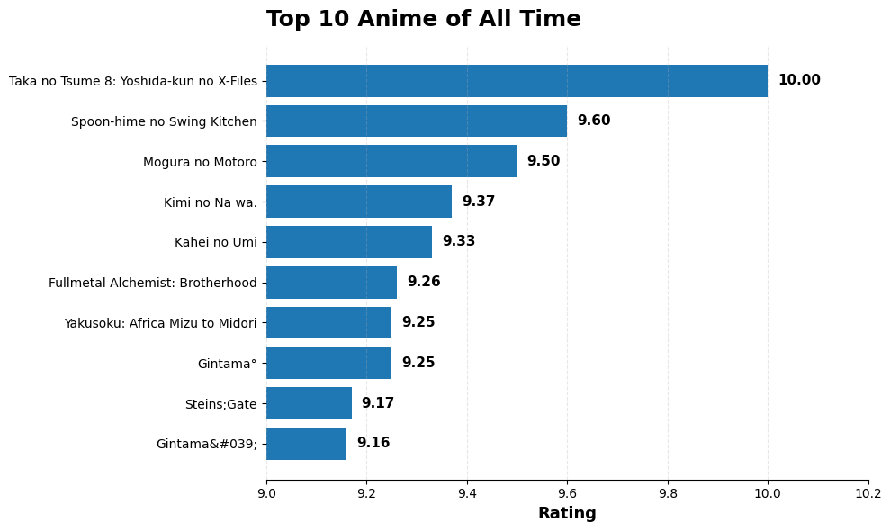
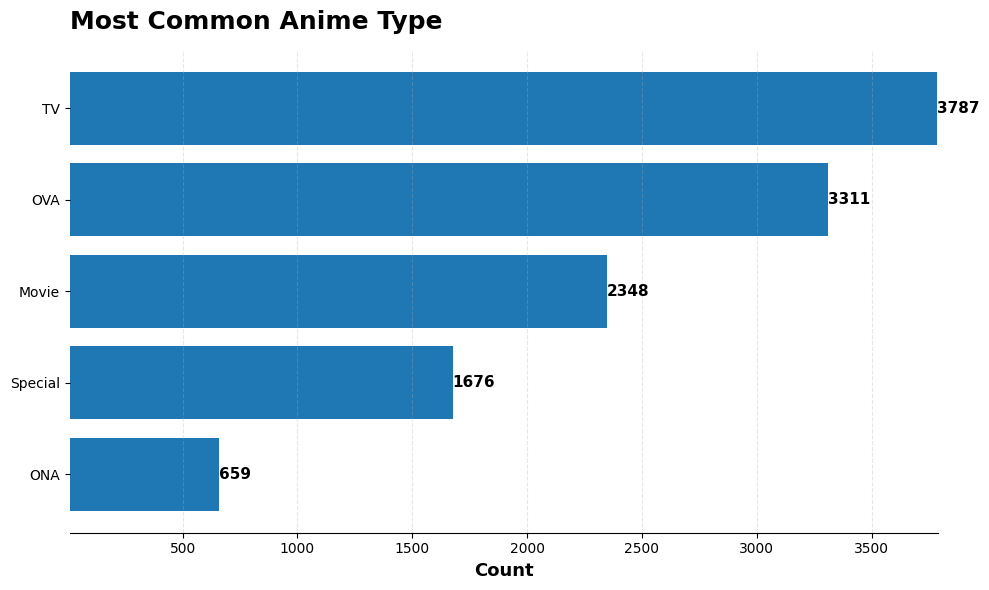
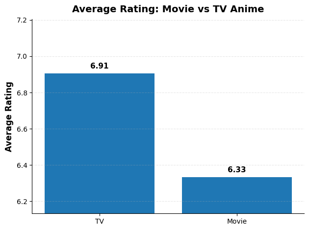
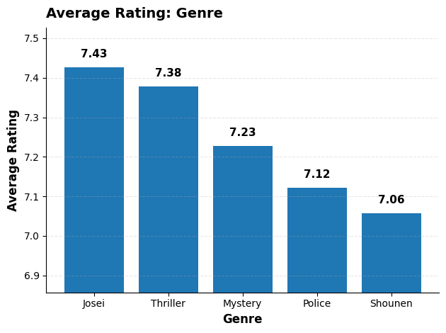
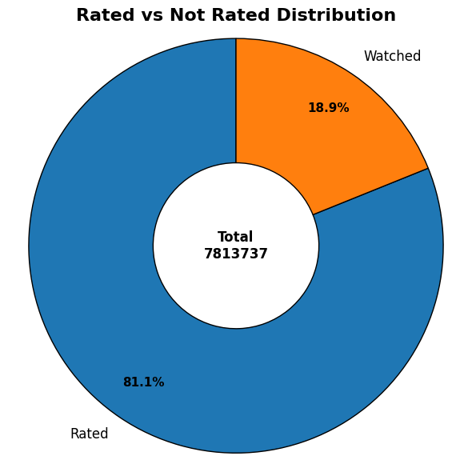
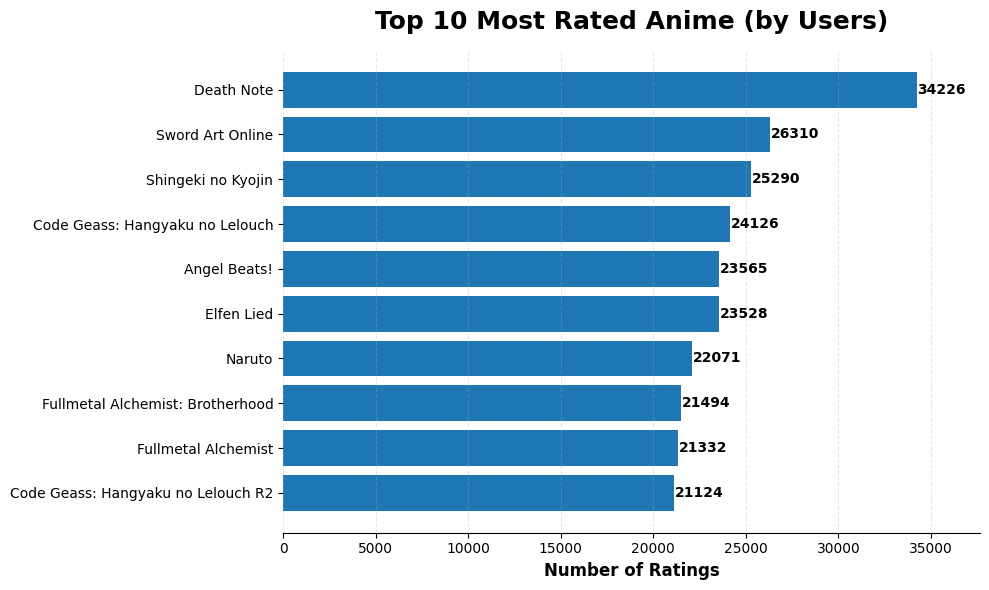
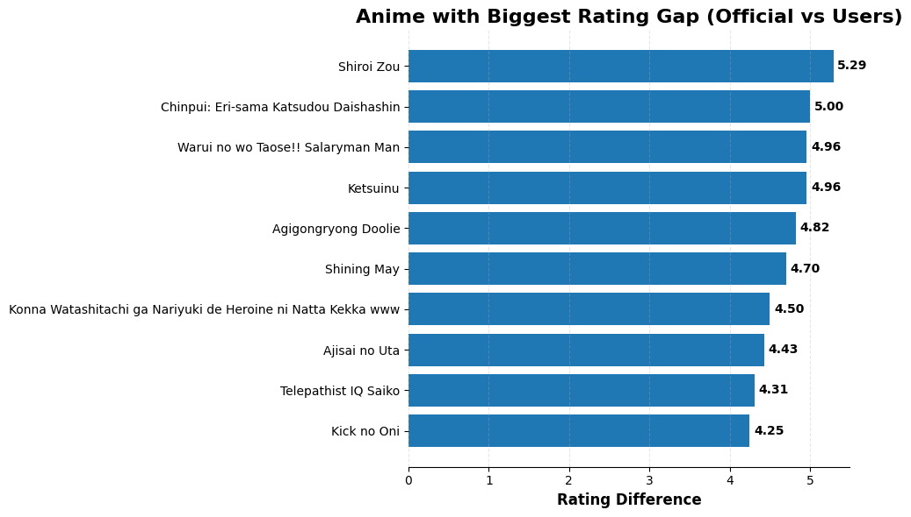
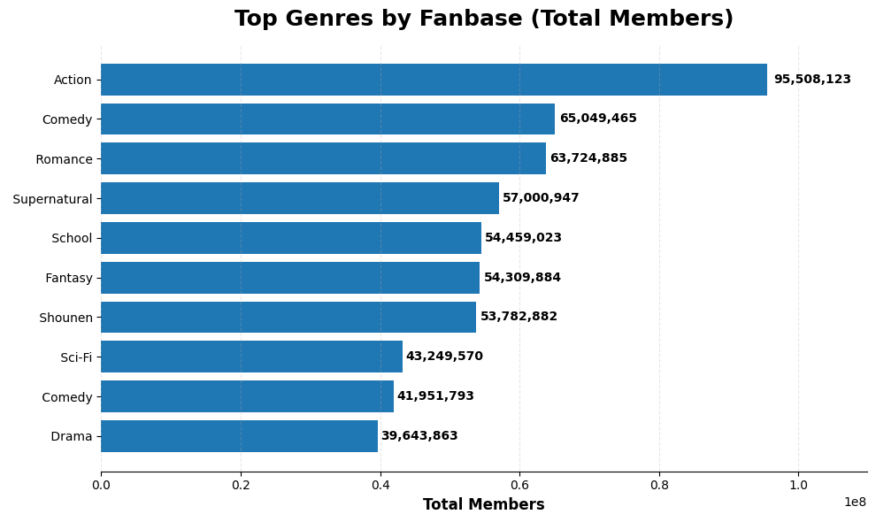
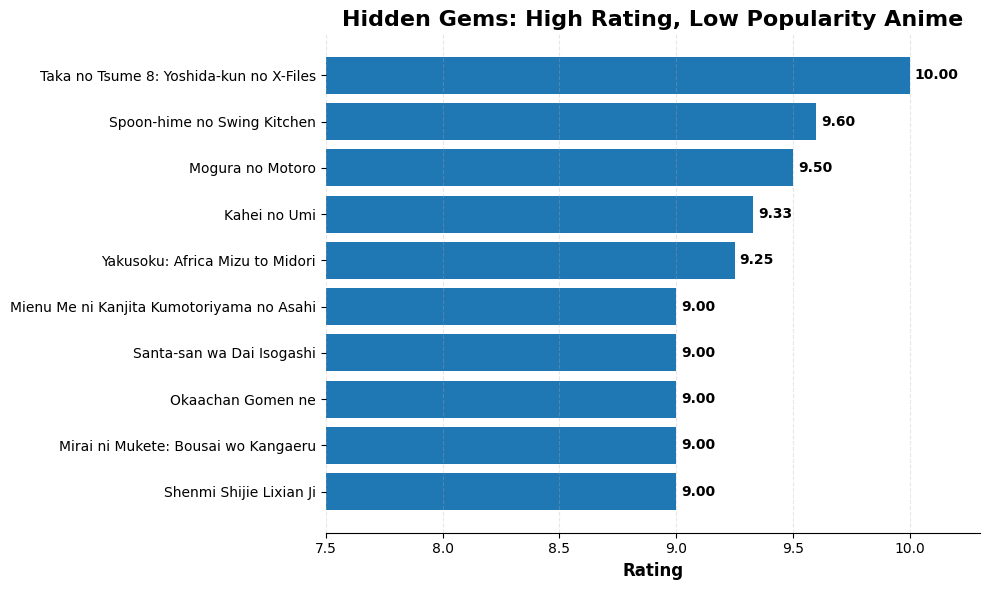

<div align="center">

# 🎌 Anime Dataset — Ratings & Popularity Analysis
### Exploratory Data Analysis | Python · Pandas · Matplotlib · Seaborn


</div>

---

## 📌 Project Overview

This project analyses a two-table anime dataset — 12,294 anime titles and 7.8 million user ratings — to uncover what makes anime popular, which genres dominate, and where a streaming platform can find undiscovered high-quality content to acquire.

| Detail | Info |
|---|---|
| **Dataset** | Anime Recommendations Database |
| **Source** | Kaggle |
| **Anime Titles** | 12,294 |
| **User Ratings** | 7,813,737 |
| **Tools** | Python, Pandas, NumPy, Matplotlib, Seaborn |

---

## 📂 Project Structure

```
anime-ratings-analysis/
│
├── Data/
│   ├── anime.csv          # Anime metadata — title, genre, type, rating, members
│   └── rating.csv         # User ratings — 7.8M rows
│
├── notebook.ipynb         # Full EDA notebook
├── Charts/
│   ├── Top_10_anime.png
│   ├── Common_Anime_type.png
│   ├── Avg_Rating.png
│   ├── Avg_Rating_genre.png
│   ├── Rated_vs_watched.png
│   ├── Top_rated_by_users.png
│   ├── Rating_gap.png
│   ├── Top_genre.png
│   └── Hidden_gem.png
└── README.md
```

---

## 🗄️ Dataset Schema

| Table | Key Column | Description |
|---|---|---|
| `anime.csv` | `anime_id` | Title, genre (multi-value), type, episodes, official rating, member count |
| `rating.csv` | `user_id`, `anime_id` | User rating 1–10, or -1 if watched but not rated |

---

## 🧹 Data Cleaning Summary

| Step | What Was Done |
|---|---|
| Multi-value genres | Split by comma using `str.split(',')` before exploding |
| Wrong data type | `episodes` had `'Unknown'` strings → replaced with `np.nan` → cast to `float` |
| Null filling | `episodes` and `rating` filled with median, `type` and `genre` with `'Unknown'` |
| Duplicates | Checked on `anime_id` — zero duplicates |
| Rating -1 handling | Classified using `pd.cut()` into `Rated` vs `Watched` groups |

**Post-cleaning: 12,294 anime · Zero nulls · Zero duplicates**

---

## 📊 Analysis & Key Insights

---

### Q1. 🏆 Top 10 Highest Rated Anime of All Time



| Rank | Anime | Rating |
|---|---|---|
| 1 | Taka no Tsume 8: Yoshida-kun no X-Files | 10.00 |
| 2 | Spoon-hime no Swing Kitchen | 9.60 |
| 3 | Mogura no Motoro | 9.50 |
| 4 | Kimi no Na wa. | 9.37 |
| 5 | Fullmetal Alchemist: Brotherhood | 9.26 |
| 8 | Gintama° | 9.25 |
| 9 | Steins;Gate | 9.17 |

> **Key Takeaway:** The top 3 are obscure titles with perfect or near-perfect scores — likely driven by a small number of extremely dedicated fans. The more meaningful benchmark starts at rank 4 where globally recognised titles like *Kimi no Na wa.* and *Fullmetal Alchemist: Brotherhood* appear. A streaming platform should weigh both rating AND member count when making acquisition decisions.

---

### Q2. 📺 Most Common Anime Type



| Type | Count |
|---|---|
| TV | 3,787 |
| OVA | 3,311 |
| Movie | 2,348 |
| Special | 1,676 |
| ONA | 659 |

> **Key Takeaway:** TV series dominate the anime library at 3,787 titles — nearly double the ONA count. OVAs at 3,311 are surprisingly close to TV volume, reflecting Japan's long tradition of bonus video releases. Movies at 2,348 represent a significant catalogue opportunity for streaming platforms that typically focus on series content.

---

### Q3. 🎭 Most Common Anime Genre

> **Key Takeaway:** Comedy, Action and Adventure dominate anime genre counts — the same genres that dominate global entertainment. This isn't surprising, but it confirms that anime's mass-market appeal aligns with mainstream genre preferences rather than being niche-only content.

---

### Q4. ⭐ Average Rating — TV vs Movie



| Type | Avg Rating |
|---|---|
| TV | 6.91 |
| Movie | 6.33 |

> **Key Takeaway:** TV anime rate significantly higher than Movies on average — a 0.58 point gap. This likely reflects the deeper audience investment that comes with multi-episode series. Movies are consumed more casually and rated more critically. Platforms should note that TV series drive higher engagement and satisfaction scores.

---

### Q5. 🔗 Members vs Rating — Correlation

> **Key Takeaway:** The correlation between member count and rating is positive but weak — popularity alone doesn't guarantee quality ratings. Some widely-watched anime are divisively rated (e.g. Sword Art Online), while critically acclaimed titles can have smaller but more dedicated audiences.

---

### Q6. 🥇 Highest Rated Genres



| Rank | Genre | Avg Rating |
|---|---|---|
| 1 | Josei | 7.43 |
| 2 | Thriller | 7.38 |
| 3 | Mystery | 7.23 |
| 4 | Police | 7.12 |
| 5 | Shounen | 7.06 |

> **Key Takeaway:** Josei — anime targeted at adult women — has the highest average rating at 7.43, despite not being among the most common genres. This suggests a highly engaged, quality-focused audience. Thriller and Mystery also punch above their weight. A streaming platform looking for high ROI content should invest in these underrepresented but high-quality genres.

---

### Q7. 👁️ Rated vs Watched Distribution



| Status | Count | Share |
|---|---|---|
| Rated (1–10) | 6,335,636 | 81.1% |
| Watched Only (-1) | 1,478,101 | 18.9% |

> **Key Takeaway:** 81.1% of interactions include an actual rating — a strong engagement signal. Only 1 in 5 users watches without rating. This means the rating data is dense and reliable for recommendation and acquisition analysis — unlike many platforms where rating participation is below 20%.

---

### Q8. 📊 Most Rated Anime by Users



| Rank | Anime | User Ratings |
|---|---|---|
| 1 | Death Note | 34,226 |
| 2 | Sword Art Online | 26,310 |
| 3 | Shingeki no Kyojin | 25,290 |
| 4 | Code Geass | 24,126 |
| 5 | Angel Beats! | 23,565 |

> **Key Takeaway:** Death Note leads with 34,226 user ratings — 30% more than the second-place title. This reflects its status as many viewers' entry point into anime. Interestingly, Sword Art Online ranks #2 in user ratings despite its divisive official score — proving that engagement and critical reception can diverge significantly.

---

### Q9. 🔍 Biggest Rating Gap — Official vs Users



| Rank | Anime | Rating Gap |
|---|---|---|
| 1 | Shiroi Zou | 5.29 |
| 2 | Chinpui: Eri-sama Katsudou Daishashin | 5.00 |
| 3 | Warui no wo Taose!! Salaryman Man | 4.96 |

> **Key Takeaway:** The largest gaps are all older, obscure titles where official ratings are inflated by a tiny number of initial raters. A 5.29 point gap means the official score is completely unreliable for these anime. This analysis exposes a key data quality issue — minimum rating count thresholds should be applied before using official ratings for business decisions.

---

### Q10. 👥 Top Genres by Total Fanbase



| Rank | Genre | Total Members |
|---|---|---|
| 1 | Action | 95,508,123 |
| 2 | Comedy | 65,049,465 |
| 3 | Romance | 63,724,885 |
| 4 | Supernatural | 57,000,947 |
| 5 | School | 54,459,023 |

> **Key Takeaway:** Action dominates with 95.5 million total members — nearly 47% more than Comedy in second place. Romance and Supernatural are close at #3 and #4, reflecting the strong overlap between these genres in popular series like *Kimi no Na wa.* A streaming platform should ensure its Action catalogue is comprehensive — it drives the largest audience by a significant margin.

---

### Q11. 💎 Hidden Gems — High Rating, Low Popularity



> **Key Takeaway:** Using a quantile-based threshold (bottom 25% by member count, above 8.0 rating), several critically acclaimed but undiscovered titles emerge. These are ideal streaming acquisition targets — high quality content that hasn't reached mainstream audiences yet. Acquiring these before they trend could significantly reduce licensing costs while building a reputation for quality curation.

---

## 🔑 Executive Summary — 5 Things a Streaming Platform Should Know

| # | Insight | Action |
|---|---|---|
| 1 | Death Note has 34K ratings — most engaged community | Feature in onboarding for new anime viewers |
| 2 | Josei is highest rated genre despite low volume | Invest in underrepresented but high-quality Josei titles |
| 3 | TV series rate 0.58 higher than Movies | Prioritise TV series in catalogue expansion |
| 4 | 18.9% of views have no rating | Add in-app rating nudges post-viewing |
| 5 | Official ratings unreliable for obscure titles | Apply minimum rating count filter in all quality assessments |

---

## 🛠️ Skills Demonstrated

- **Multi-table Analysis** — joining 7.8M row ratings table with anime metadata
- **Multi-value Column Handling** — `str.split()` + `explode()` for genre analysis
- **Data Type Correction** — string-to-float conversion with intermediate null handling
- **Rating Classification** — `pd.cut()` on -1 sentinel values
- **Quantile-based Filtering** — hidden gems using `quantile(0.25)` threshold
- **Large Dataset Handling** — filtering and aggregating 7.8M rows efficiently
- **Data Visualization** — horizontal bar charts, donut charts, heatmap, dynamic label formatting

---

## 👤 Author

**Abhay Panchal**
BBA (IGNOU) · BMS (DU SOL)
Aspiring Data Analyst · Python · SQL · Power BI · Excel

📍 Ghaziabad, Delhi NCR

---

*Dataset sourced from Kaggle. This is a portfolio project for learning and demonstration purposes.*
