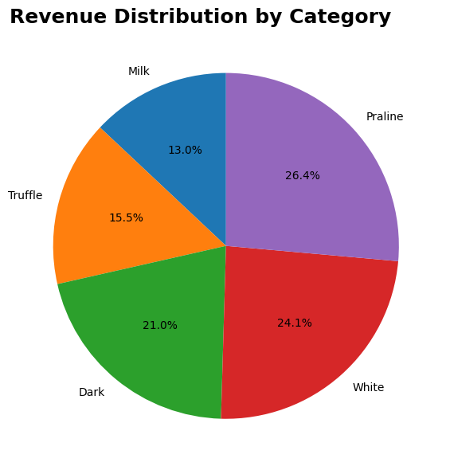
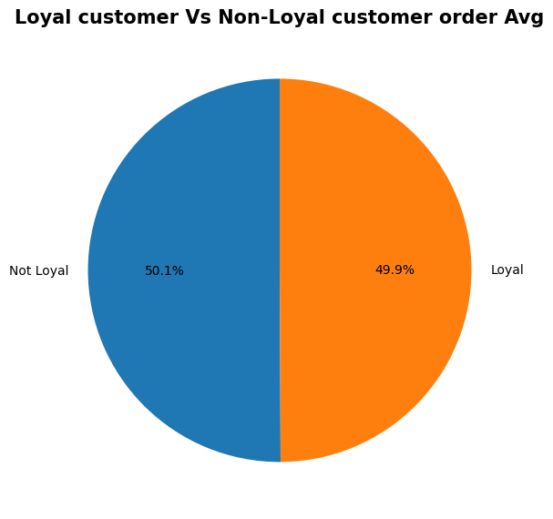
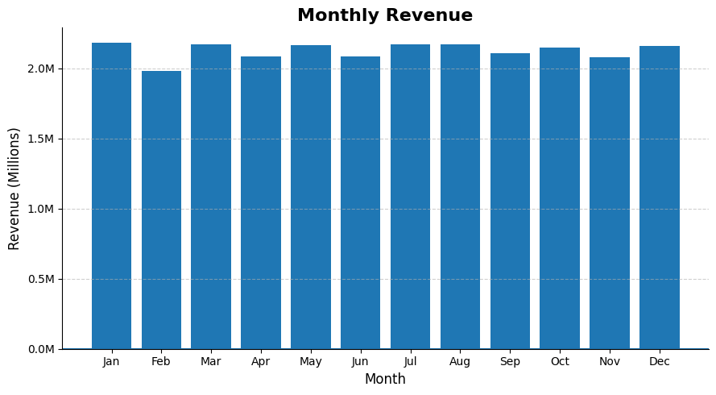
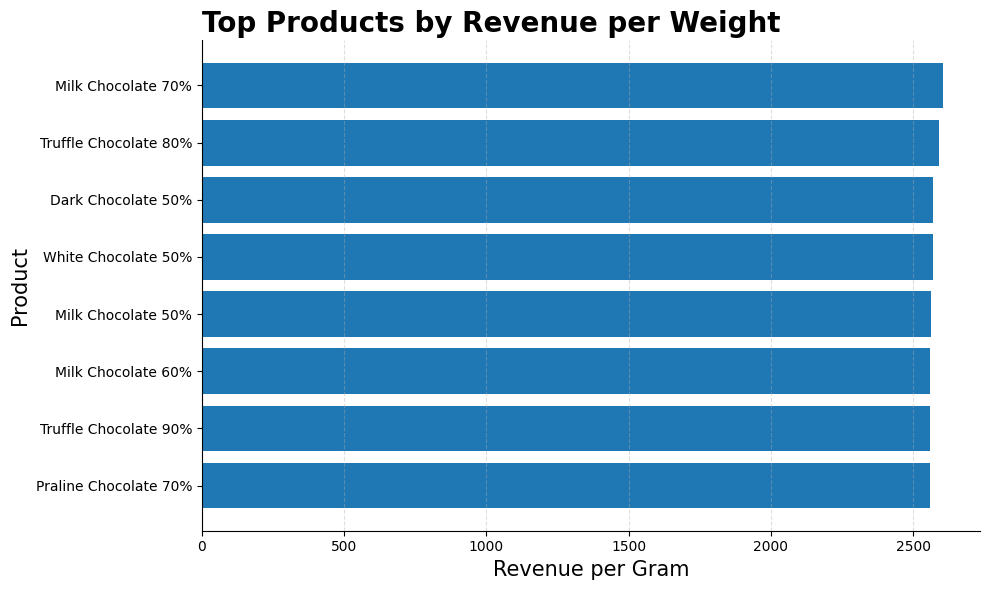
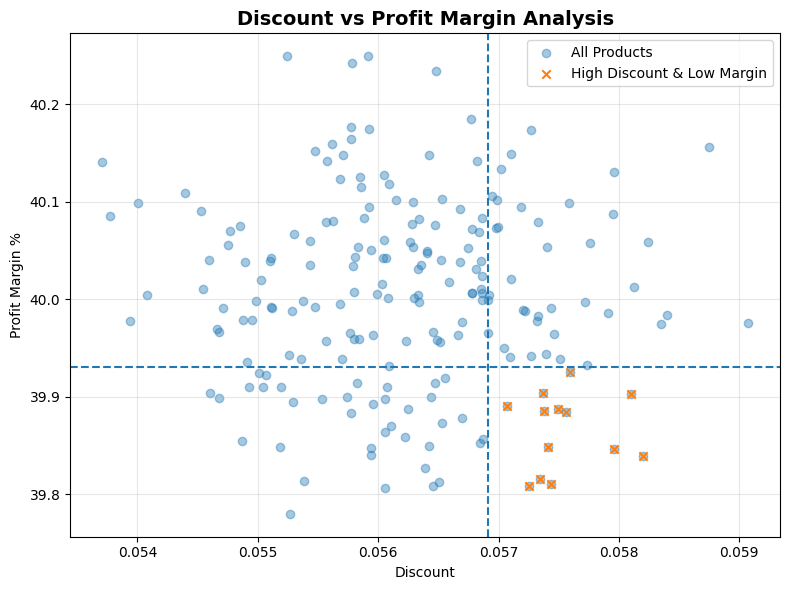

<div align="center">

# 🍫 Chocolate Sales Analysis
### Exploratory Data Analysis | Python · Pandas · Matplotlib


</div>

---

## 📌 Project Overview

This project analyses a multi-table chocolate retail sales dataset to uncover patterns in revenue, product performance, customer loyalty, store profitability, and discount strategy. The dataset spans 5 related tables simulating a real-world retail data warehouse.

| Detail | Info |
|---|---|
| **Dataset** | Chocolate Retail Sales |
| **Total Orders** | 1,000,000 |
| **Total Revenue** | $25,486,128 |
| **Total Profit** | $10,194,564 |
| **Overall Profit Margin** | 40.00% |
| **Tools** | Python, Pandas, NumPy, Matplotlib |

---

## 📂 Project Structure

```
chocolate-sales-analysis/
│
├── Data/
│   ├── sales.csv          # Order-level transactions
│   ├── stores.csv         # Store metadata
│   ├── products.csv       # Product catalog
│   ├── customers.csv      # Customer profiles
│   └── calendar.csv       # Date dimension table
│
├── notebook.ipynb         # Full EDA notebook
├── Charts/                # All exported visualizations
│   ├── Revenue_category.png
│   ├── monthly_revenue.png
│   ├── Loyal_customer.png
│   ├── Top_product.png
│   └── Bad_product.png
└── README.md
```

---

## 🗄️ Dataset Schema

| Table | Key Column | Description |
|---|---|---|
| `sales` | `order_id` | Transaction-level data — revenue, cost, profit, discount |
| `products` | `product_id` | Product name, brand, category, cocoa %, weight |
| `stores` | `store_id` | Store name, city, country, store type |
| `customers` | `customer_id` | Age, gender, loyalty status, join date |
| `calendar` | `date` | Year, month, day, week, day of week |

---

## 🧹 Data Cleaning Summary

| Issue | Column | Fix Applied |
|---|---|---|
| Wrong data type | `order_date` | Converted to datetime |
| Wrong data type | `calendar.date` | Converted to datetime |
| Multi-table analysis | All tables | Joined via `pd.merge()` on key columns |

**Post-cleaning: Zero nulls · Zero duplicates — dataset was production-quality**

---

## 📊 Analysis & Key Insights

---

### Q1. 💰 Total Revenue, Cost & Profit

| Metric | Value |
|---|---|
| Total Revenue | $25,486,128 |
| Total Cost | $15,291,554 |
| Total Profit | $10,194,564 |
| Profit Margin | **40.00%** |

> **Key Takeaway:** A 40% profit margin is strong for retail — every $1 of revenue returns 40 cents in profit. The consistency of this margin across the entire dataset suggests uniform pricing and cost structure across all products and stores.

---

### Q2. 🎂 Revenue Distribution by Category



| Rank | Category | Revenue | Share |
|---|---|---|---|
| 🥇 1 | Praline | $6,665,641 | 26.4% |
| 🥈 2 | White | $6,070,172 | 24.1% |
| 🥉 3 | Dark | $5,298,123 | 21.0% |
| 4 | Truffle | $3,924,343 | 15.5% |
| 5 | Milk | $3,280,368 | 13.0% |

> **Key Takeaway:** Praline leads revenue at 26.4% despite not being the most popular chocolate type globally — it commands premium pricing. Milk chocolate, the world's most popular flavour, ranks last on Netflix revenue, suggesting the product mix skews toward premium segments. Truffle and Milk are underperforming relative to their market popularity and represent growth opportunities.

---

### Q3. 👥 Customer Purchase Coverage

| Metric | Value |
|---|---|
| Total Registered Customers | 50,000 |
| Customers Who Purchased | 50,000 |
| Purchase Rate | **100%** |

> **Key Takeaway:** Every registered customer has made at least one purchase — perfect conversion rate. This is a strong signal that the customer acquisition funnel is healthy and there are no inactive accounts dragging down engagement metrics.

---

### Q4. 🏪 Top Stores by Profit

| Rank | Store | City | Country | Total Profit |
|---|---|---|---|---|
| 🥇 1 | Chocolate Store 74 | Sydney | USA | $104,810 |
| 🥈 2 | Chocolate Store 33 | Toronto | Australia | $104,520 |
| 🥉 3 | Chocolate Store 50 | New York | Canada | $104,000 |

> **Key Takeaway:** The top 3 stores are separated by less than $810 in profit — remarkably tight performance across locations. No single store dominates, suggesting a well-standardised operations model. Store 74 in Sydney edges out the top spot — worth investigating what local factors contribute to its slight edge.

---

### Q5. 🏷️ Average Discount per Category

| Category | Avg Discount |
|---|---|
| Praline | 5.64% |
| Dark | 5.63% |
| Truffle | 5.62% |
| White | 5.62% |
| Milk | 5.60% |

> **Key Takeaway:** Discount rates are virtually identical across all categories — a range of just 0.04%. This means discounting is not being used strategically to push underperforming categories. There is room to use targeted discounts on Milk and Truffle to boost their revenue share without impacting the top performers.

---

### Q6. 🛡️ Loyalty Members vs Non-Members



| Customer Type | Avg Revenue per Order |
|---|---|
| Non-Loyalty Member | $25.52 |
| Loyalty Member | $25.45 |

> **Key Takeaway:** Loyalty members spend virtually the same per order as non-members — the difference is just $0.07. This suggests the loyalty programme is not successfully driving higher spend per transaction. The programme needs restructuring — tiered rewards or minimum spend incentives could push loyal customers to increase basket size.

---

### Q7. 📅 Monthly Revenue Trend



| Highest Month | Revenue | Lowest Month | Revenue |
|---|---|---|---|
| January | $2,179,770 | February | $1,978,991 |

> **Key Takeaway:** Revenue is remarkably stable across all 12 months — the gap between the best (January, $2.18M) and worst (February, $1.98M) month is only ~9%. There are no seasonal peaks or troughs, suggesting either very consistent demand or that promotional activity smooths out natural seasonality. February's dip likely reflects fewer calendar days.

---

### Q8. 📊 Profit Margin by Brand

| Rank | Brand | Profit Margin |
|---|---|---|
| 1 | Lindt | 40.02% |
| 2 | Ferrero | 40.01% |
| 3 | Mars | 40.00% |
| 4 | Hershey | 40.00% |
| 5 | Cadbury | 39.98% |
| 6 | Godiva | 39.98% |

> **Key Takeaway:** All 6 brands operate at virtually identical ~40% profit margins — a range of just 0.04%. This eliminates brand as a differentiator for profitability decisions. Procurement and pricing are standardised across the brand portfolio, which simplifies inventory management but removes the ability to use brand as a margin lever.

---

### Q9. ⚖️ Top Products by Revenue per Weight



> **Key Takeaway:** The top products by revenue-to-weight ratio are nearly equal — all clustered around $2,550 per gram. This means weight is not a meaningful differentiator for revenue efficiency in this catalogue. Pricing appears to be consistent per gram regardless of product type, suggesting a weight-based pricing model rather than value-based pricing.

---

### Q10. 🚨 Discount Campaign — Products Draining Revenue



> **Key Takeaway:** The scatter plot identifies products in the top-right danger zone — high discount rate (above 75th percentile) combined with low profit margin (below 25th percentile). These products are the primary targets for the marketing team's discount review. Removing or reducing discounts on these products would directly improve overall profit margin without affecting the majority of the catalogue.

---

## 🔑 Executive Summary — 5 Things the Business Should Know

| # | Insight | Business Implication |
|---|---|---|
| 1 | 40% profit margin across the board | Strong unit economics — focus on volume growth |
| 2 | Loyalty members don't spend more | Loyalty programme needs restructuring with spend incentives |
| 3 | Praline leads revenue at 26.4% | Expand Praline product range to capitalise on demand |
| 4 | Milk chocolate is last at 13% | Underperforming vs market popularity — pricing or range issue |
| 5 | Discounts are uniform across categories | Strategic discounting on slow categories could shift revenue mix |

---

## 🛠️ Skills Demonstrated

- **Multi-table Joins** — merging 5 related tables using `pd.merge()`
- **Aggregation & Groupby** — revenue, profit, margin calculations per segment
- **Derived Metrics** — profit margin %, revenue-to-weight ratio, loyalty spend comparison
- **Quantile-based Analysis** — identifying outlier products using `.quantile()`
- **Data Visualization** — bar charts, pie charts, scatter plots with threshold lines
- **Business Thinking** — every analysis tied to a real retail decision

---

## 👤 Author

**Abhay Panchal**
BBA (IGNOU) · BMS (DU SOL)
Aspiring Data Analyst · Python · SQL · Power BI · Excel

📍 Ghaziabad, Delhi NCR

---

*This is a portfolio project built on a synthetic dataset for learning and demonstration purposes.*
