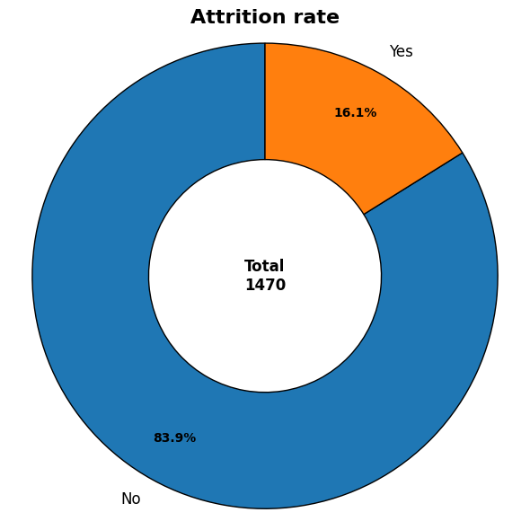
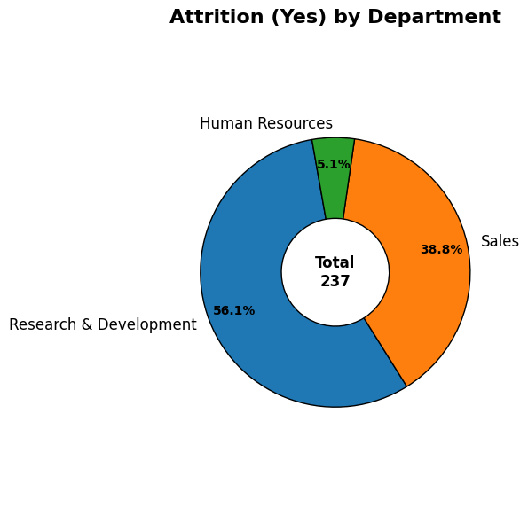
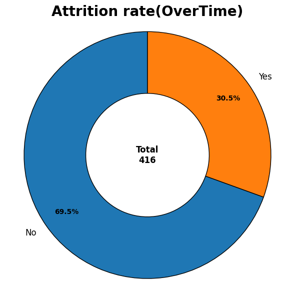
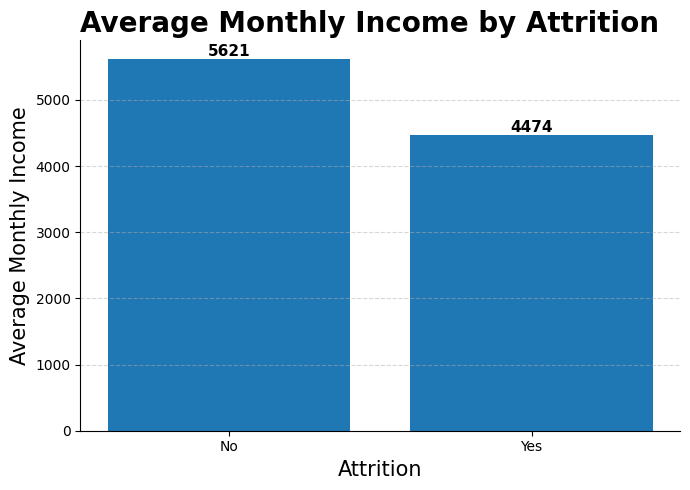
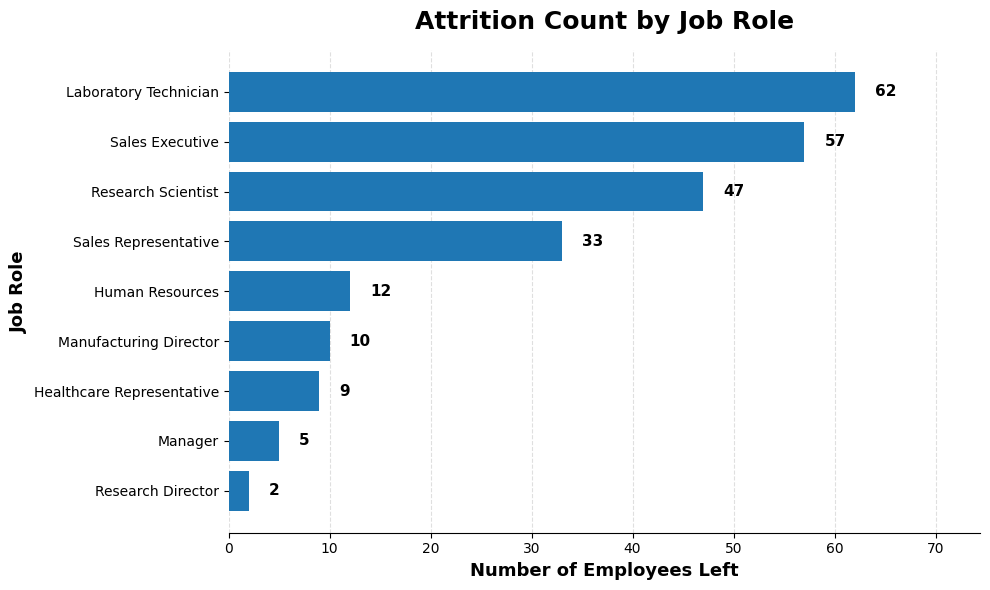
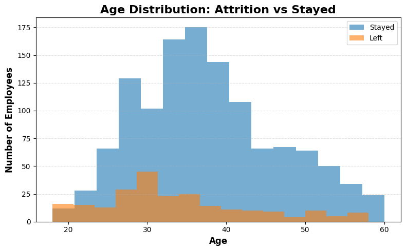
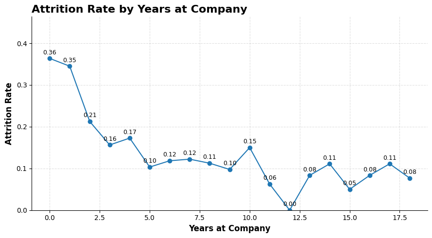
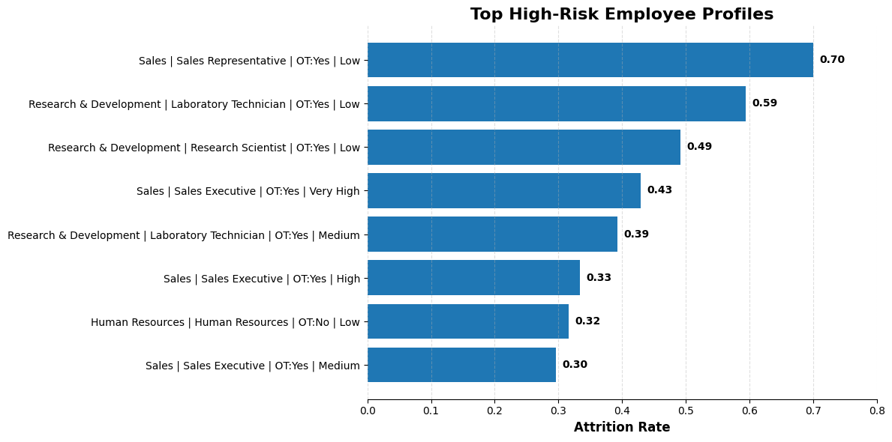

<div align="center">

# 🏢 IBM HR Analytics — Employee Attrition Analysis
### Exploratory Data Analysis | Python · Pandas · Matplotlib · Seaborn


</div>

---

## 📌 Project Overview

This project analyses IBM's HR dataset to identify the key drivers of employee attrition — why people leave, who leaves most, and what the highest-risk employee profile looks like. The goal is to give HR teams actionable data to reduce turnover and prioritise retention interventions.

| Detail | Info |
|---|---|
| **Dataset** | IBM HR Analytics Employee Attrition & Performance |
| **Source** | Kaggle — pavansubhasht/ibm-hr-analytics-attrition-dataset |
| **Total Employees** | 1,470 |
| **Columns** | 35 (demographics, performance, satisfaction, compensation) |
| **Tools** | Python, Pandas, NumPy, Matplotlib |

---

## 📂 Project Structure

```
ibm-hr-attrition-analysis/
│
├── Data/
│   └── WA_Fn-UseC_-HR-Employee-Attrition.csv
│
├── notebook.ipynb              # Full EDA notebook
├── Charts/
│   ├── Attrition_rate.png
│   ├── Attrition_by_depart.png
│   ├── Attrition_by_overtime.png
│   ├── Avg_income_by_attrition.png
│   ├── Attrition_by_Job_role.png
│   ├── Age_distribution.png
│   ├── Attrition_by_loyalty.png
│   └── High_risk_employee.png
└── README.md
```

---

## 🧹 Data Cleaning Summary

| Step | What Was Done |
|---|---|
| Outlier Detection | Boxplots visualised for all numeric columns pre-cleaning |
| Outlier Handling | IQR method using `select_dtypes` — applied dynamically to all numeric columns |
| Null Filling | Median fill for all numeric columns post-outlier removal |
| Duplicates | Removed with `drop_duplicates()` |
| Data Types | All correct — no conversion needed |

**Post-cleaning: 1,470 employees · Zero nulls · Zero duplicates**

> Notable improvement: Using `select_dtypes(include='number')` to automatically detect numeric columns — more robust than manually listing column names.

---

## 📊 Analysis & Key Insights

---

### Q1. 📉 Overall Attrition Rate



| Status | Count | Rate |
|---|---|---|
| Stayed | 1,233 | 83.9% |
| Left | 237 | **16.1%** |

> **Key Takeaway:** 1 in 6 employees leaves IBM — a 16.1% attrition rate. Industry benchmark for tech/consulting is typically 10–15%, placing IBM slightly above average. Every percentage point of attrition reduction saves significant recruitment and onboarding costs — typically 50–200% of the departing employee's annual salary.

---

### Q2. 🏬 Attrition by Department



| Department | Employees Left | Share of Attrition |
|---|---|---|
| Research & Development | 133 | 56.1% |
| Sales | 92 | 38.8% |
| Human Resources | 12 | 5.1% |

> **Key Takeaway:** R&D accounts for over half of all attrition despite being the largest department. However, raw count can be misleading — Sales has a proportionally higher attrition *rate* given its smaller headcount. HR losing 12 employees is significant for a department that manages people for the rest of the company.

---

### Q3. 👥 Gender Distribution Among Leavers

> **Key Takeaway:** Male employees account for a higher share of attrition in absolute numbers, consistent with IBM's overall workforce being majority male. The gender split among leavers closely mirrors the overall gender distribution — suggesting gender alone is not a strong attrition driver at IBM.

---

### Q4. ⏰ Overtime vs Attrition



| Group | Attrition Rate |
|---|---|
| Works Overtime | **30.5%** |
| No Overtime | ~10% |

> **Key Takeaway:** Employees who work overtime are 3× more likely to leave than those who don't. 30.5% of the 416 overtime workers have left — this is the single strongest attrition signal in the dataset. Overtime is not just a workload issue — it's a retention crisis indicator. HR should immediately audit which teams are consistently requiring overtime and address root causes.

---

### Q5. 💰 Average Monthly Income — Leavers vs Stayers



| Status | Avg Monthly Income |
|---|---|
| Stayed | $5,621 |
| Left | $4,474 |
| Difference | **$1,147 (20.4% gap)** |

> **Key Takeaway:** Employees who left earned on average $1,147 less per month than those who stayed — a 20.4% income gap. This is a strong signal that below-market compensation is a major attrition driver. A targeted salary adjustment programme for employees earning below the $5,000 threshold could significantly reduce turnover.

---

### Q6. 💼 Attrition Count by Job Role



| Rank | Job Role | Employees Left |
|---|---|---|
| 1 | Laboratory Technician | 62 |
| 2 | Sales Executive | 57 |
| 3 | Research Scientist | 47 |
| 4 | Sales Representative | 33 |
| 9 | Research Director | 2 |

> **Key Takeaway:** Laboratory Technicians have the highest attrition count at 62 — nearly double the Research Director count of 2. Senior roles show far lower attrition, suggesting career progression and seniority are strong retention factors. Entry and mid-level technical roles are the most vulnerable — IBM should focus retention programmes on these groups specifically.

---

### Q7. ⚖️ Work-Life Balance vs Attrition

> **Key Takeaway:** Employees who left had a slightly lower average work-life balance score than those who stayed. While the difference is small in absolute terms, combined with the overtime finding it paints a consistent picture — IBM's attrition problem is partly driven by unsustainable working conditions, particularly in technical and sales roles.

---

### Q8. 📊 Age Distribution — Leavers vs Stayers



> **Key Takeaway:** Younger employees (18–30) show a disproportionately high attrition rate relative to their headcount. The peak leaving age is around 28–30, which aligns with early-career professionals exploring better opportunities after gaining initial experience. Employees aged 35–45 show much stronger retention — suggesting that once employees cross the mid-career threshold, loyalty increases significantly.

---

### Q9. 📅 Attrition Rate by Years at Company



| Years at Company | Attrition Rate |
|---|---|
| Year 0 | 36% |
| Year 1 | 35% |
| Year 2 | 21% |
| Year 5+ | ~10–12% |
| Year 12 | 0% |

> **Key Takeaway:** The first two years are the most critical — attrition peaks at 36% for new joiners. By year 5, the rate drops to ~10%, and long-tenured employees (10+ years) are extremely stable. This pattern is classic "honeymoon hangover" — IBM needs a structured onboarding and early-career development programme to retain employees through their first 24 months.

---

### Q10. 🚨 High-Risk Employee Profiles



| Profile | Attrition Rate |
|---|---|
| Sales \| Sales Rep \| OT:Yes \| Low Salary | **70%** 🔴 |
| R&D \| Lab Technician \| OT:Yes \| Low Salary | 59% 🔴 |
| R&D \| Research Scientist \| OT:Yes \| Low Salary | 49% 🟠 |
| Sales \| Sales Executive \| OT:Yes \| Very High Salary | 43% 🟠 |
| R&D \| Lab Technician \| OT:Yes \| Medium Salary | 39% 🟠 |

> **Key Takeaway:** The highest-risk profile is crystal clear — **Sales Representative, working overtime, on a low salary, in the Sales department — 70% attrition rate.** 7 out of 10 employees in this exact profile leave. The pattern across the top 5 profiles is consistent: Overtime + Low Salary = retention crisis. Even high-salary Sales Executives working overtime show 43% attrition — proving that money alone doesn't fix burnout.

---

## 🔑 Executive Summary — 5 Things HR Should Act On Now

| # | Insight | Recommended Action |
|---|---|---|
| 1 | Overtime workers leave at 3× the rate | Audit overtime-heavy teams and redistribute workload |
| 2 | Leavers earn 20% less than stayers | Salary review for employees below $5,000/month |
| 3 | 36% of new joiners leave in year 1 | Build a structured 24-month onboarding programme |
| 4 | Lab Technicians & Sales Reps are highest risk | Create role-specific retention packages |
| 5 | OT + Low Salary = 70% attrition | Immediate intervention for this specific profile |

---

## 🛠️ Skills Demonstrated

- **Dynamic Outlier Handling** — `select_dtypes` for automatic column detection
- **Attrition Rate Calculation** — `lambda x: (x == 'Yes').mean()` pattern
- **Risk Profile Engineering** — multi-column groupby with count threshold to avoid small-sample bias
- **Salary Bucketing** — `pd.cut()` for income brackets
- **Data Visualization** — donut charts, bar charts, overlapping histograms, line charts with data labels
- **Business Thinking** — every insight tied to a specific HR intervention

---

## 👤 Author

**Abhay Panchal**
BBA (IGNOU) · BMS (DU SOL)
Aspiring Data Analyst · Python · SQL · Power BI · Excel

📍 Ghaziabad, Delhi NCR

---

*Dataset sourced from Kaggle (IBM HR Analytics). This is a portfolio project for learning and demonstration purposes.*
