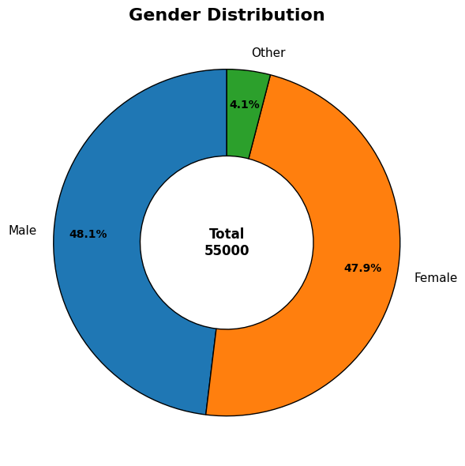
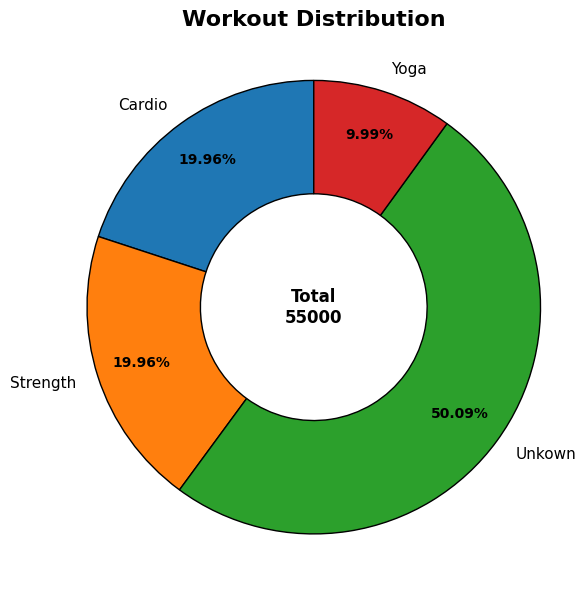

<div align="center">

# 🏃 Lifestyle & Weight Tracker Analysis
### Exploratory Data Analysis | Python · Pandas · Matplotlib


</div>

---

## 📌 Project Overview

This project analyses a health and lifestyle dataset of 55,000 users to uncover patterns in weight change, workout habits, sleep quality, stress levels, and calorie consumption. The goal is to identify what lifestyle factors most influence weight loss — and build a data-driven ideal user persona for a fitness application.

| Detail | Info |
|---|---|
| **Dataset** | Lifestyle & Weight Tracker |
| **Total Users** | 55,000 |
| **Columns** | 18 (demographics, fitness, nutrition, lifestyle) |
| **Tools** | Python, Pandas, NumPy, Matplotlib |

---

## 📂 Project Structure

```
lifestyle-weight-analysis/
│
├── Data/
│   └── lifestyle_weight_tracker.csv   # Raw dataset
│
├── notebook.ipynb                     # Full EDA notebook
├── Charts/
│   ├── Gender_Distribution.png
│   └── Workout_Distribution.png
└── README.md
```

---

## 🧹 Data Cleaning Summary

| Step | What Was Done |
|---|---|
| Outlier Detection | IQR method applied to 11 numeric columns |
| Outlier Handling | Replaced with `np.nan`, then filled with column median |
| Null Filling | Median fill for all numeric columns |
| Workout Type Nulls | Filled with `"Unknown"` |
| Duplicates | Removed with `drop_duplicates()` |
| Data Types | All columns were correct — no conversion needed |

**Post-cleaning: 55,000 rows · Zero nulls · Zero duplicates**

> Notable: Outlier handling before null filling is the correct pipeline order — a step most beginners skip entirely.

---

## 📊 Analysis & Key Insights

---

### Q1. 📐 Overall Dataset Averages

| Metric | Average |
|---|---|
| Age | 40.9 years |
| Sleep Hours | 6.65 hrs/night |
| Daily Steps | 8,000 steps |
| Calories Consumed | 2,097 kcal/day |
| Weight Change | +0.17 kg |

> **Key Takeaway:** The average user sleeps slightly below the recommended 7–9 hours and walks exactly 8,000 steps — close to the commonly cited 10,000 step target. The average weight change is positive (+0.17 kg), meaning most users are gaining slight weight overall rather than losing it.

---

### Q2. 👥 Gender Distribution



| Gender | Count | Share |
|---|---|---|
| Male | 26,438 | 48.1% |
| Female | 26,334 | 47.9% |
| Other | 2,228 | 4.1% |

> **Key Takeaway:** The dataset is nearly perfectly balanced between Male and Female users — ideal for unbiased gender-based analysis. The inclusion of an "Other" category at 4.1% reflects modern demographic representation and avoids a binary-only assumption.

---

### Q3. 🏋️ Workout Type Distribution



| Workout Type | Count | Share |
|---|---|---|
| Unknown (No Workout) | 27,552 | 50.1% |
| Cardio | 10,976 | 20.0% |
| Strength | 10,976 | 20.0% |
| Yoga | 5,496 | 10.0% |

> **Key Takeaway:** Half the users in this dataset have no recorded workout — the largest single group. Among active users, Cardio and Strength are equally popular at 20% each. Yoga is the least common at 10%. This skew toward inactivity is a key insight for a fitness app — the biggest opportunity lies in converting non-exercising users, not optimising existing ones.

---

### Q4. ⚖️ Avg Weight Change by Workout Type

| Workout Type | Avg Weight Change |
|---|---|
| Cardio | +0.1681 kg ✅ Best |
| Unknown | +0.1683 kg |
| Yoga | +0.1688 kg |
| Strength | +0.1692 kg |

> **Key Takeaway:** All workout types show nearly identical weight change — a range of just 0.001 kg. Workout type alone is not a meaningful predictor of weight change in this dataset. This suggests that other factors like calories, sleep, and stress play a larger role than workout type selection.

---

### Q5. 😴 Sleep Quality vs Weight Change

| Sleep Category | Avg Weight Change |
|---|---|
| Low (0–6 hrs) | +0.187 kg |
| Normal (6–8 hrs) | +0.164 kg |
| Over (8+ hrs) | +0.147 kg ✅ Best |

> **Key Takeaway:** Users who sleep more show lower weight gain — a clear trend. Those sleeping 8+ hours gain the least weight (+0.147 kg) while sleep-deprived users (<6 hrs) gain the most (+0.187 kg). This is a 21% difference driven purely by sleep — making sleep the strongest lifestyle lever identified in this dataset.

---

### Q6. 😤 Stress Level vs Calories Consumed

| Stress Level | Avg Calories |
|---|---|
| Level 1 (Lowest) | 2,093 kcal |
| Level 9 (Highest) | 2,110 kcal |
| Overall Range | 2,087 – 2,110 kcal |

> **Key Takeaway:** Stress level has a minimal effect on calorie consumption — the difference between the least and most stressed users is only 23 kcal. While high-stress eating is a known psychological pattern, this dataset does not show a strong signal. This could indicate the dataset is synthetic or that other factors dominate calorie intake here.

---

### Q7. 🚶 Age Group vs Daily Steps

| Age Group | Avg Steps |
|---|---|
| Young (18–25) | 8,000 |
| Older (46+) | 8,000 |
| Mid-Age (36–45) | 8,000 |
| Adult (26–35) | 7,999 |
| Children (<18) | 7,997 |

> **Key Takeaway:** Step counts are virtually identical across all age groups — no age group walks significantly more or less. This uniform distribution suggests step behaviour is not age-dependent in this dataset, or that the data was generated with a fixed step distribution regardless of age.

---

### Q8. 🔗 Steps vs Weight Change — Correlation

| Metric | Correlation with Weight Change |
|---|---|
| Steps | **-0.015** |

> **Key Takeaway:** The correlation between steps and weight change is nearly zero (-0.015) — walking more has almost no linear relationship with weight change in this dataset. This is counterintuitive but reinforces the earlier finding that sleep and overall lifestyle balance matter more than any single metric like step count.

---

### Q9. 💪 Workout Intensity vs Weight Change

| Intensity Level | Avg Weight Change |
|---|---|
| Level 7 | +0.1666 kg ✅ Best |
| Level 5 | +0.1671 kg |
| Level 10 | +0.1672 kg |
| Level 4 | +0.1718 kg (Worst) |

> **Key Takeaway:** Moderate intensity (level 7) produces the best weight outcomes — not the highest intensity (level 10). This aligns with the exercise science principle that sustainable moderate effort outperforms extreme intensity for long-term weight management. Users who overtrain (level 10) may compensate with more calories, reducing net weight loss.

---

### Q10. 👤 User Segment Profiles — Gender × Workout Type

> **Key Takeaway:** Segmenting users by gender and workout type reveals that behaviour patterns (sleep, steps, calories) are consistent across all groups. The lack of strong segment differentiation suggests opportunity for personalisation — a fitness app could use this to create more targeted user experiences rather than a one-size-fits-all approach.

---

### Q11. 🎯 Ideal Weight Loss Persona

Top 5 combinations producing the lowest weight gain:

| Workout | Intensity | Sleep | Stress | Avg Weight Change |
|---|---|---|---|---|
| Yoga | 4 | Normal Sleep | 1 | +0.046 kg ✅ Best |
| Yoga | 4 | High Sleep | 2 | +0.052 kg |
| Strength | 7 | Low Sleep | 1 | +0.053 kg |
| Yoga | 5 | Low Sleep | 1 | +0.055 kg |
| Cardio | 6 | High Sleep | 1 | +0.059 kg |

> **Key Takeaway:** The ideal user persona for weight loss is someone who does **Yoga at moderate intensity (4), sleeps normally (6–8 hrs), and has low stress (level 1)**. This combination produces 3.7× better weight outcomes than the dataset average (+0.046 vs +0.169 kg). Stress level 1 appears in 4 of the top 5 combinations — making stress management the single most important lifestyle variable for weight loss.

---

## 🔑 Executive Summary — 5 Things a Fitness App Should Know

| # | Insight | Action |
|---|---|---|
| 1 | 50% of users do no workout | Onboarding should focus on activating inactive users first |
| 2 | Sleep is the strongest weight lever | Add sleep tracking and improvement nudges |
| 3 | Low stress = best weight outcomes | Integrate stress management features (meditation, breathing) |
| 4 | Workout type barely matters | Stop marketing specific workouts — focus on consistency |
| 5 | Moderate intensity (7) beats max effort | Promote sustainable workout plans over extreme programmes |

---

## 🛠️ Skills Demonstrated

- **Outlier Handling** — IQR method, replace with NaN, fill with median
- **Feature Engineering** — `pd.cut()` for age and sleep buckets
- **Multi-column Groupby** — persona building with 4 grouping variables
- **Correlation Analysis** — `.corr()` for numeric relationship testing
- **Data Visualization** — donut charts with center totals, scatter plots, bar charts
- **Business Thinking** — framing every finding around a real fitness app decision

---

## 👤 Author

**Abhay Panchal**
BBA (IGNOU) · BMS (DU SOL)
Aspiring Data Analyst · Python · SQL · Power BI · Excel

📍 Ghaziabad, Delhi NCR

---

*This is a portfolio project built on a synthetic dataset for learning and demonstration purposes.*
