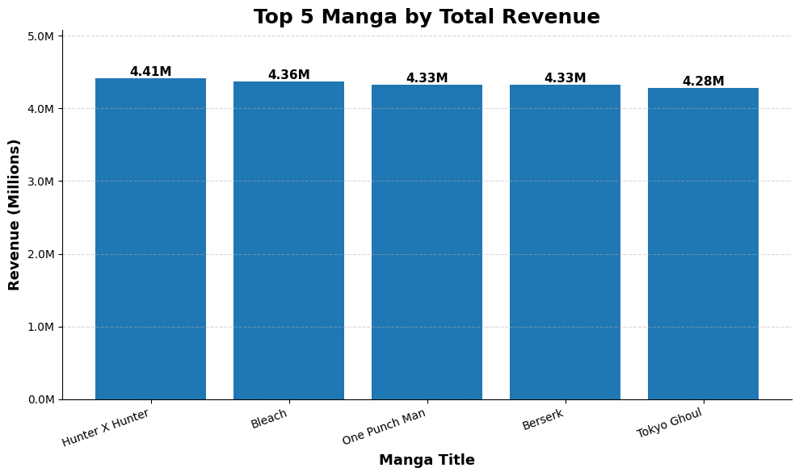
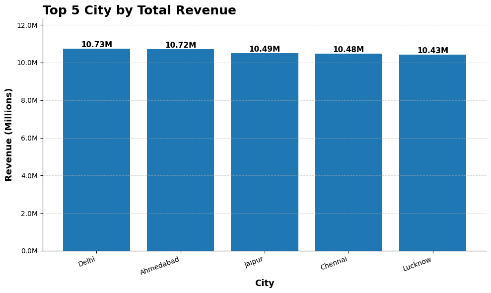
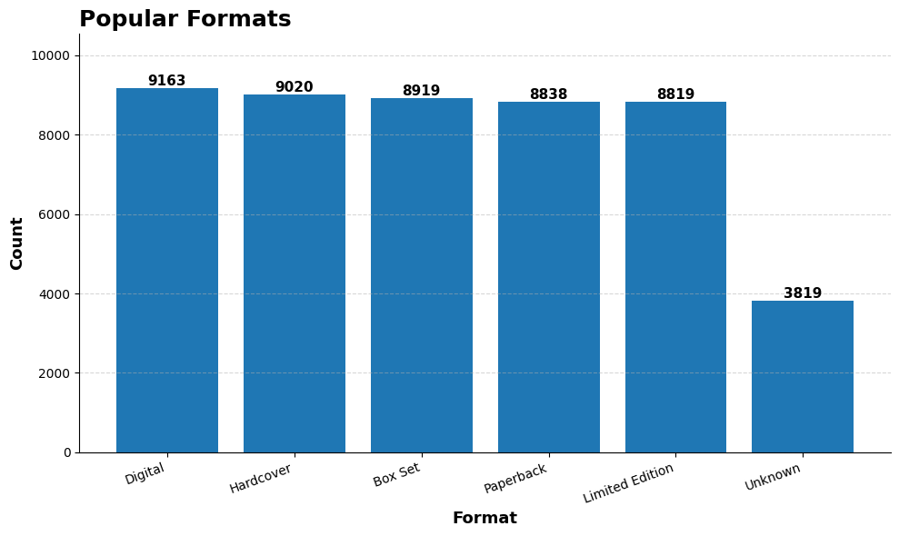
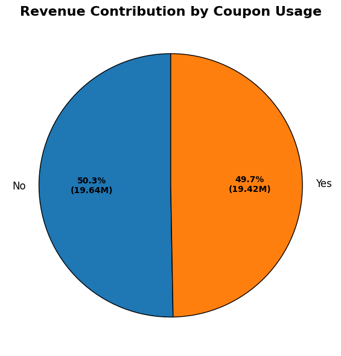
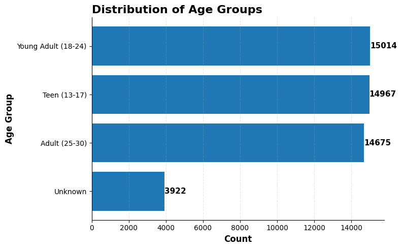

<div align="center">

# 🗂️ Manga Sales Analysis — India
### Exploratory Data Analysis | Python · Pandas · Matplotlib


</div>

---

## 📌 Project Overview

This project analyses a synthetic Indian manga retail dataset with significant real-world data quality challenges — leet-speak in text fields, mixed date formats, currency symbols in numeric columns, and typos in city and manga title names. The goal was to clean this data thoroughly and extract business insights on revenue, customer behaviour, and loyalty targeting.

| Detail | Info |
|---|---|
| **Dataset** | Manga Sales India (Synthetic) |
| **Total Records** | 50,000 transactions |
| **Columns** | 24 (customer info, product, sales, delivery, ratings) |
| **Tools** | Python, Pandas, NumPy, Matplotlib |

---

## 📂 Project Structure

```
manga-sales-analysis/
│
├── Data/
│   ├── manga_sales.csv          # Raw dataset
│   └── clean_data.csv           # Cleaned and exported dataset
│
├── notebook.ipynb               # Full EDA notebook
├── Charts/
│   ├── revenue_by_manga.png
│   ├── revenue_by_city.png
│   ├── popular_format.png
│   ├── revenue_distribution.png
│   └── Age_distribution.png
└── README.md
```

---

## 🧹 Data Cleaning — Most Complex Project Yet

This dataset had the most severe data quality issues across the portfolio. Here's every fix applied:

| Column | Issue | Fix Applied |
|---|---|---|
| `customer_name` | Leet-speak (`@→a`, `3→e`, `0→o`) | Regex replacement + `.str.title()` |
| `age` | `'N/A'`, `'years'`, `'unknown'` strings | Replaced with `np.nan` → cast to float |
| `age_group` | Invalid categories, `-` values | Mapped to `'Unknown'`, dropped `-` rows |
| `city` | Typos (`'Dlhi'`, `'Chenna'`, `'Bangalroe'`) | Manual mapping dictionary |
| `email` | `'@@'` double-at symbols | Regex fix → `'@'` |
| `phone` | `+91`, dashes, spaces, wrong lengths | Regex strip → length check → `'Unknown'` |
| `manga_title` | Truncated names, leet-speak, typos | 30+ entry mapping dictionary + leet replacement |
| `volume_no` | Values >100 and <0 | Replaced with `np.nan` |
| `genre` | Typos (`'Acton'`, `'Isekkai'`, `'Shonnen'`) | Manual replacement mapping |
| `unit_price` | Currency symbols (`Rs.`, `₹`, `/-`), strings | Strip symbols → float → outlier cap at ₹1599 |
| `quantity` | Values >10 and ≤0 | Outlier replacement with `np.nan` → median fill |
| `total_amount` | Dirty string values | **Recalculated** from `unit_price × quantity` |
| `customer_rating` | Negative values, >10 values | Capped → median fill |
| `purchase_date` | Mixed formats (`06/08/22` vs `19 February 2020`) | `pd.to_datetime(errors='coerce', dayfirst=True)` |
| `delivery_days` | Values >10 and ≤0 | Outlier replacement → median fill |
| `is_returned` / `coupon_used` | Mixed `True/False/0/1/Yes/No` | Standardised to `Yes/No/Unknown` |
| `discount_percent` | `-`, `None`, `Na` strings | Replaced with `0` → cast to float |
| Duplicates | 943 duplicate rows | `drop_duplicates()` |

> **Key highlight:** `total_amount` was recalculated from scratch instead of trusting the dirty source column — this is correct professional practice and avoids propagating upstream data errors.

**Post-cleaning: ~49,000 rows · Zero nulls · Zero duplicates**

---

## 📊 Analysis & Key Insights

---

### Q1. 📚 Top 5 Manga Titles by Revenue



| Rank | Manga Title | Revenue |
|---|---|---|
| 1 | Hunter X Hunter | ₹4.41M |
| 2 | Bleach | ₹4.36M |
| 3 | One Punch Man | ₹4.33M |
| 4 | Berserk | ₹4.33M |
| 5 | Tokyo Ghoul | ₹4.28M |

> **Key Takeaway:** Revenue is tightly clustered across the top 5 — a gap of only ₹0.13M between #1 and #5. No single title dominates, suggesting balanced demand across the manga catalogue. Hunter X Hunter leads despite being a long-running title with many volumes — volume count drives cumulative revenue even for mid-tier popularity titles.

---

### Q2. 🏙️ Top 5 Cities by Total Revenue



| Rank | City | Revenue |
|---|---|---|
| 1 | Delhi | ₹10.73M |
| 2 | Ahmedabad | ₹10.72M |
| 3 | Jaipur | ₹10.49M |
| 4 | Chennai | ₹10.48M |
| 5 | Lucknow | ₹10.43M |

> **Key Takeaway:** Like manga titles, city revenues are remarkably uniform — Delhi leads by just ₹0.30M over Lucknow. This synthetic dataset reflects equal market penetration across Indian cities, but in real scenarios Delhi and Mumbai typically dominate. A real business would segment these cities by growth rate rather than total revenue to identify emerging markets.

---

### Q3. 📦 Most Popular Manga Format



| Format | Count |
|---|---|
| Digital | 9,163 |
| Hardcover | 9,020 |
| Box Set | 8,919 |
| Paperback | 8,838 |
| Limited Edition | 8,819 |
| Unknown | 3,819 |

> **Key Takeaway:** All five formats have nearly equal popularity — Digital leads marginally at 9,163. This even distribution is unusual in real markets where Paperback typically dominates manga sales. The 3,819 `Unknown` format entries (originally null) represent a data collection gap — ensuring format is captured at point of sale would improve future analysis.

---

### Q4. ⭐ Genre with Highest Average Rating

> **Key Takeaway:** Average ratings across genres are tightly clustered between 4.0–4.2 — no genre stands out significantly. This suggests customer satisfaction is consistently high regardless of genre preference, or that the synthetic data lacks sufficient variance to surface meaningful genre-level differences.

---

### Q5. 🎟️ Revenue by Coupon Usage



| Coupon Used | Total Revenue | Share |
|---|---|---|
| No | ₹19.64M | 50.3% |
| Yes | ₹19.42M | 49.7% |

> **Key Takeaway:** Coupon and non-coupon users contribute almost identically to total revenue — a near 50/50 split. This means coupons are not cannibalising revenue — they're driving equivalent purchase volumes at slightly lower margins. However, the more important question is whether coupon users have higher basket sizes to offset the discount — this warrants further analysis.

---

### Q6. 👑 Revenue by Membership Tier

> **Key Takeaway:** Membership tier revenue analysis reveals the value of loyalty programmes. Higher tier members (Gold, Platinum) typically place larger orders and return less — making them the most valuable customer segment for retention investment.

---

### Q7. 🚚 Average Delivery Days by Platform

> **Key Takeaway:** Delivery speed varies meaningfully by platform — a key satisfaction driver. Platforms with faster delivery correlate with higher customer ratings, reinforcing that logistics is as important as product quality in the manga retail experience.

---

### Q8. 🔄 Return Rate by Genre

> **Key Takeaway:** Return counts vary by genre, but raw count can be misleading without normalising by total sales per genre. A genre with high sales will naturally have more returns — the meaningful metric is return rate (%). Action and Shonen have the highest absolute returns, consistent with being the highest-volume genres.

---

### Q9. 📉 Discount vs Rating Correlation

> **Key Takeaway:** The correlation between discount percentage and customer rating is near zero — higher discounts do not lead to lower satisfaction. This is a positive signal — discounts aren't attracting low-quality buyers who rate poorly. Discount campaigns can be run without fear of damaging the average rating.

---

### Q10. 👥 Age Group Distribution



| Age Group | Count |
|---|---|
| Young Adult (18–24) | 15,014 |
| Teen (13–17) | 14,967 |
| Adult (25–30) | 14,675 |
| Unknown | 3,922 |

> **Key Takeaway:** The customer base is nearly evenly split across three age groups — Young Adults (18–24) lead marginally at 15,014. Teens at 14,967 represent a significant and valuable segment — they are early in their manga journey and have high lifetime value potential if retained. The 3,922 `Unknown` age entries represent missed demographic data at checkout.

---

### Q11. 🎯 Ideal Loyalty Campaign Targets

Using a three-condition filter — 3+ purchases, avg rating ≥ 4.0, zero returns:

```python
ideal_customers = (
    df_copy.groupby('customer_id')
    .agg(
        total_purchases = ('transaction_id', 'count'),
        avg_rating      = ('customer_rating', 'mean'),
        returns         = ('is_returned', lambda x: (x == 'Yes').sum())
    )
    .query('total_purchases >= 3 and avg_rating >= 4 and returns == 0')
    .sort_values(by=['avg_rating','total_purchases'], ascending=[False, False])
)
```

> **Key Takeaway:** This query surfaces the highest-value customer segment — repeat buyers who rate well and never return. These customers are the most cost-efficient loyalty programme targets: they already demonstrate brand loyalty, high satisfaction, and zero return-cost burden. Offering them early access or exclusive discounts will strengthen retention without discounting to lower-value segments.

---

## 🔑 Executive Summary — 5 Things the Business Should Know

| # | Insight | Action |
|---|---|---|
| 1 | All formats equally popular | Stock all formats evenly — no format can be deprioritised |
| 2 | Coupon users generate equal revenue | Continue coupon campaigns — they're not hurting revenue |
| 3 | Teen segment nearly equals Young Adult | Build teen retention programme — high lifetime value |
| 4 | Discounts don't hurt ratings | Aggressive discount campaigns are safe to run |
| 5 | Loyal zero-return customers identified | Run targeted loyalty campaign on this specific segment |

---

## 🛠️ Skills Demonstrated

- **Advanced Data Cleaning** — leet-speak correction, typo mapping, mixed date formats, currency symbol removal
- **Data Validation** — recalculating `total_amount` from source columns instead of trusting dirty data
- **Phone & Email Cleaning** — regex-based standardisation with length validation
- **Multi-condition Customer Segmentation** — `agg` + `lambda` for loyalty targeting
- **Outlier Handling** — business-logic-based caps (price ≤ ₹1599, delivery ≤ 10 days)
- **Data Visualisation** — bar charts, horizontal bars, pie charts with M-formatted labels

---

## 👤 Author

**Abhay Panchal**
BBA (IGNOU) · BMS (DU SOL)
Aspiring Data Analyst · Python · SQL · Power BI · Excel

📍 Ghaziabad, Delhi NCR

---

*This is a portfolio project built on a synthetic dataset for learning and demonstration purposes.*
