<div align="center">

# 🎬 Netflix Content Strategy Analysis
### Exploratory Data Analysis | Python · Pandas · Matplotlib


</div>

---

## 📌 Project Overview

This project analyses Netflix's global content library to uncover patterns in content strategy, genre preferences, country contributions, and growth trends. A special lens is applied on **India** — comparing it against global benchmarks to surface region-specific insights.

| Detail | Info |
|---|---|
| **Dataset** | Netflix Movies and TV Shows |
| **Source** | Kaggle — Netflix Content Strategy: Genre & Rating Analysis |
| **Records** | 8,807 titles |
| **Columns** | 12 (show_id, type, title, director, cast, country, date_added, release_year, rating, duration, listed_in, description) |
| **Tools** | Python, Pandas, NumPy, Matplotlib |

---

## 📂 Project Structure

```
netflix-content-analysis/
│
├── Data/
│   └── netflix_titles.csv          # Raw dataset
│
├── notebook.ipynb                  # Full EDA notebook
├── Charts/                         # All exported visualizations
│   ├── Actor_appearance.png
│   ├── Movie_Vs_TV_Show.png
│   ├── Longest_movie.png
│   ├── Top_Country.png
│   ├── Top_content.png
│   ├── Title_added.png
│   ├── popular_director.png
│   ├── common_genera.png
│   ├── Movie_duration.png
│   ├── Genres.png
│   └── Cotent.png
└── README.md
```

---

## 🧹 Data Cleaning Summary

| Issue | Column | Fix Applied |
|---|---|---|
| Missing values | `director` | Filled with `"Unknown"` |
| Missing values | `cast` | Filled with `"Unknown"` |
| Missing values | `country` | Filled with `"Unknown"` |
| Missing values | `rating`, `date_added`, `duration` | Filled with mode |
| Wrong rating values | `rating` (contained 'min') | Replaced with `"UR"` |
| Wrong data type | `date_added` | Converted to datetime |
| Multi-value columns | `listed_in`, `cast`, `country` | Split by comma, exploded for analysis |

---

## 📊 Analysis & Key Insights

---

### 1. 🎬 Movies vs TV Shows — Global & India

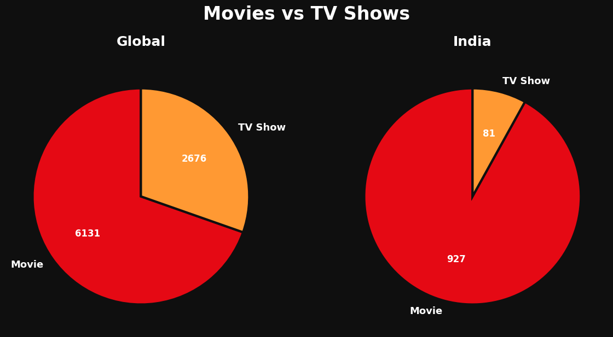

| | Global | India |
|---|---|---|
| Movies | 6,131 | 927 |
| TV Shows | 2,676 | 81 |
| Movie Share | ~70% | ~92% |

> **Key Takeaway:** Netflix is primarily a movie platform globally, but India leans even heavier toward movies at 92% share. Indian TV Show content on Netflix is severely underrepresented — only 81 titles vs 927 movies. This is a clear gap Netflix can address to compete with local OTT platforms like Hotstar and Prime Video.

---

### 2. 🌍 Top 10 Countries by Content Volume

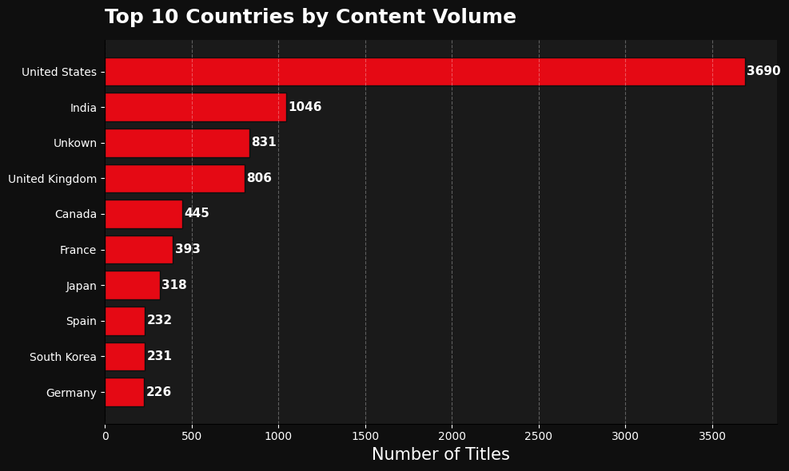

| Rank | Country | Titles |
|---|---|---|
| 🥇 1 | United States | 3,690 |
| 🥈 2 | India | 1,046 |
| 🥉 3 | Unknown | 831 |
| 4 | United Kingdom | 806 |
| 5 | Canada | 445 |

> **Key Takeaway:** The US dominates with 3,690 titles — more than 3× the second place India. The 831 "Unknown" country entries highlight a data quality issue in Netflix's own metadata. India at #2 confirms Netflix's strong investment in the Indian market, but the volume still trails the US significantly.

---

### 3. ⭐ Top 10 Most Common Content Ratings

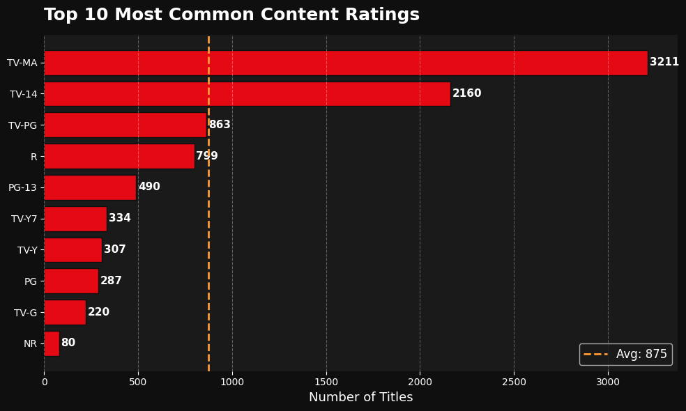

| Rating | Titles | Audience |
|---|---|---|
| TV-MA | 3,211 | Mature audiences |
| TV-14 | 2,160 | 14+ |
| TV-PG | 863 | Parental guidance |
| R | 799 | Restricted |

> **Key Takeaway:** Over 60% of Netflix content is rated TV-MA or TV-14 — Netflix clearly targets adult audiences. Family and children's content (TV-Y, TV-G, PG) is present but a secondary priority. Brands targeting family audiences should note this skew.

---

### 4. 🎞️ Top 10 Longest Movies (min. 2 hours)

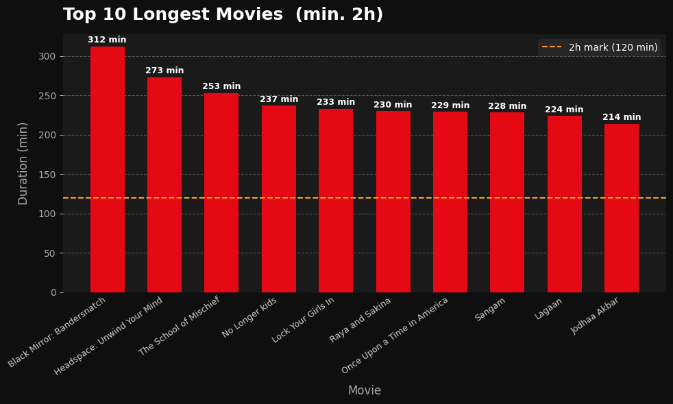

| Rank | Title | Duration |
|---|---|---|
| 1 | Black Mirror: Bandersnatch | 312 min |
| 2 | Headspace: Unwind Your Mind | 273 min |
| 3 | The School of Mischief | 253 min |
| 9 | Lagaan | 224 min |
| 10 | Jodhaa Akbar | 214 min |

> **Key Takeaway:** The longest title on Netflix at 312 minutes is an interactive experience (Bandersnatch) — not a traditional film. Two Indian films (Lagaan, Jodhaa Akbar) appear in the top 10, reinforcing that Indian cinema traditionally produces longer runtime content compared to global averages.

---

### 5. 🎭 Actor Appearances — Global & India

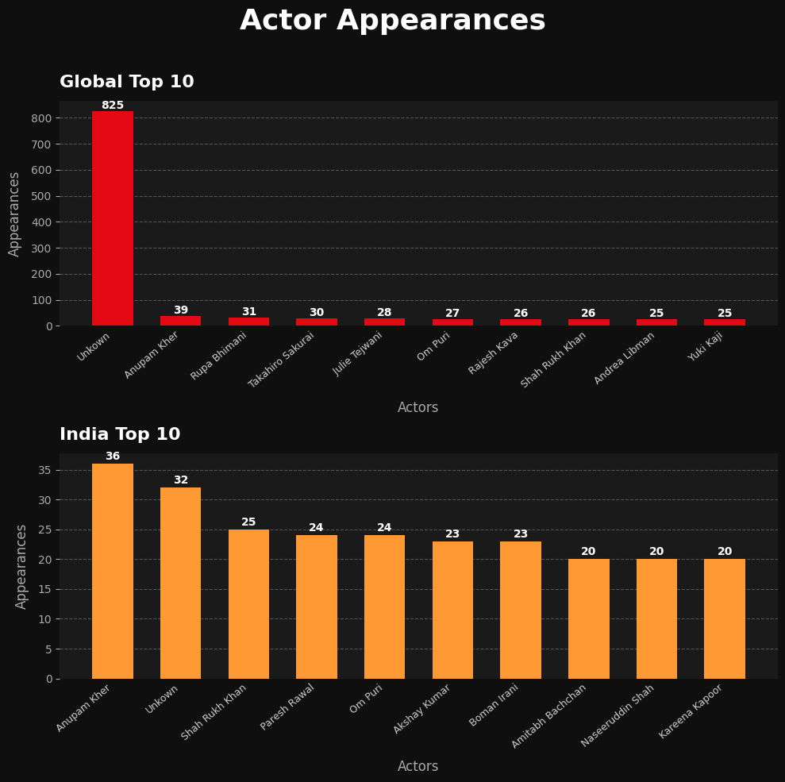

**Global:**
| Rank | Actor | Appearances |
|---|---|---|
| 1 | Unknown | 825 |
| 2 | Anupam Kher | 39 |
| 3 | Rupa Bhimani | 31 |

**India:**
| Rank | Actor | Appearances |
|---|---|---|
| 1 | Anupam Kher | 36 |
| 2 | Unknown | 32 |
| 3 | Shah Rukh Khan | 25 |

> **Key Takeaway:** Anupam Kher is the most prolific actor on Netflix both globally (#2) and in India (#1) — a testament to his career volume. Shah Rukh Khan at #3 in India confirms Bollywood A-listers have a strong Netflix presence. The high "Unknown" count globally indicates significant cast metadata gaps in the dataset.

---

### 6. 📅 Titles Added Per Year

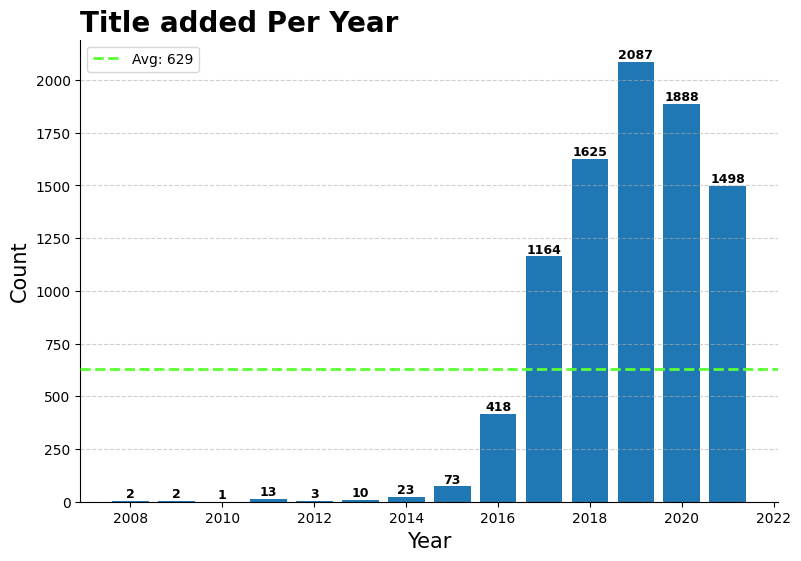

| Year | Titles Added |
|---|---|
| 2016 | 418 |
| 2017 | 1,164 |
| 2018 | 1,625 |
| 2019 | 2,087 ← Peak |
| 2020 | 1,888 |
| 2021 | 1,498 |

> **Key Takeaway:** Netflix's content addition exploded from 2016 to 2019, peaking at 2,087 titles in 2019. The slight decline post-2019 aligns with the global COVID-19 disruption to production schedules and a strategic shift toward quality over quantity. Avg titles per year: 629 — but recent years are 2-3× above average.

---

### 7. 🎬 Popular Directors by Title Count

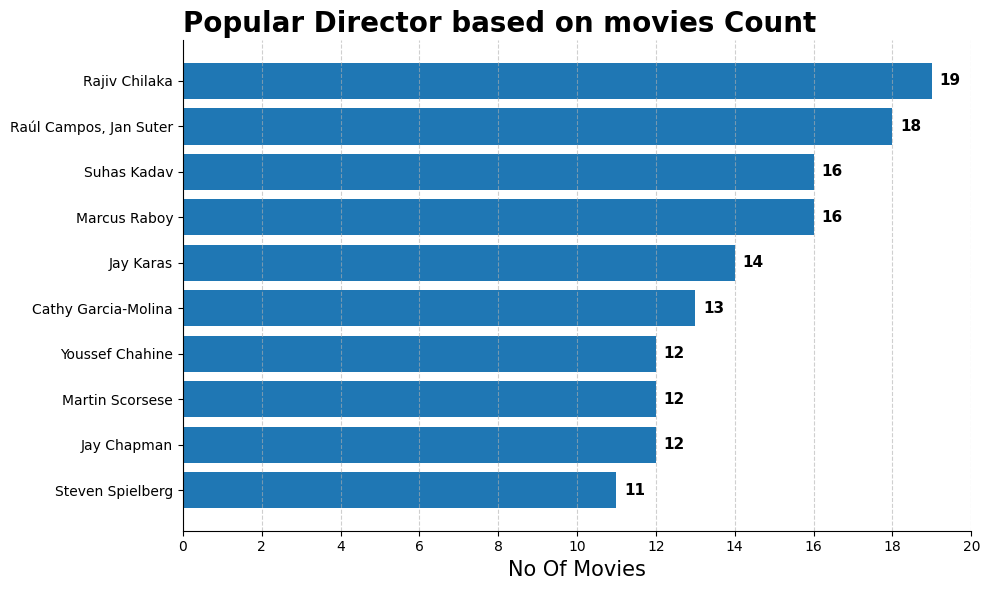

| Rank | Director | Titles |
|---|---|---|
| 1 | Rajiv Chilaka | 19 |
| 2 | Raúl Campos, Jan Suter | 18 |
| 3 | Suhas Kadav | 16 |
| 4 | Marcus Raboy | 16 |
| 8 | Martin Scorsese | 12 |
| 10 | Steven Spielberg | 11 |

> **Key Takeaway:** The top director slot is held by Rajiv Chilaka — creator of animated Indian children's content (Chhota Bheem) — not a Hollywood director. This shows Netflix's depth in animation and kids' content. Scorsese and Spielberg appearing confirms that major Hollywood catalog films are well represented.

---

### 8. 🎭 Top 10 Most Common Genres

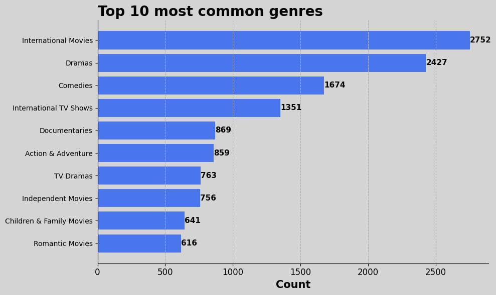

| Rank | Genre | Count |
|---|---|---|
| 1 | International Movies | 2,752 |
| 2 | Dramas | 2,427 |
| 3 | Comedies | 1,674 |
| 4 | International TV Shows | 1,351 |
| 5 | Documentaries | 869 |

> **Key Takeaway:** "International Movies" being the #1 genre confirms Netflix's global-first content strategy. Dramas dominate as the core storytelling genre across both movies and TV. Documentaries at #5 with 869 titles shows Netflix's strong investment in non-fiction — a growing streaming category.

---

### 9. ⏱️ Avg Movie Duration by Country

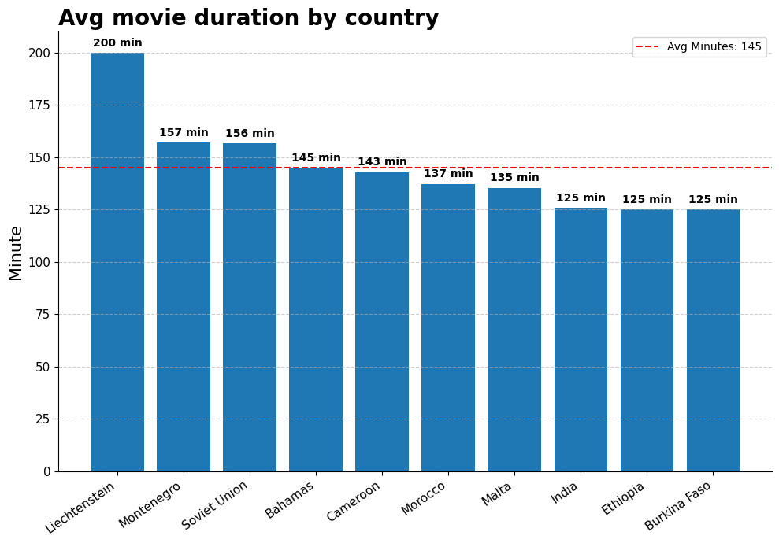

| Rank | Country | Avg Duration |
|---|---|---|
| 1 | Liechtenstein | 200 min |
| 2 | Montenegro | 157 min |
| 3 | Soviet Union | 156 min |
| 8 | India | 125 min |

> **Key Takeaway:** Liechtenstein tops avg duration at 200 min — but this is likely driven by a very small sample of titles. India at 125 min sits below the top 10 average of 145 min, suggesting Bollywood content on Netflix skews toward shorter, more accessible runtimes compared to older Indian cinema averages.

---

### 10. 🎯 Top Genres — Movies vs TV Shows

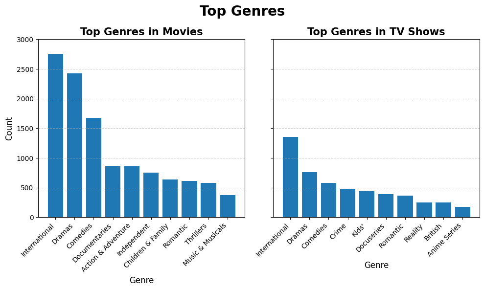

| Movies | TV Shows |
|---|---|
| International | International |
| Dramas | Dramas |
| Comedies | Comedies |
| Documentaries | Crime |
| Action & Adventure | Kids' |

> **Key Takeaway:** International content and Dramas dominate both formats — but TV Shows have a strong Crime category while Movies lean toward Action & Adventure. Kids' content is more prominent in TV Shows, suggesting parents prefer serial formats for children's viewing.

---

### 11. 📈 Content Growth Trend — Movies vs TV Shows

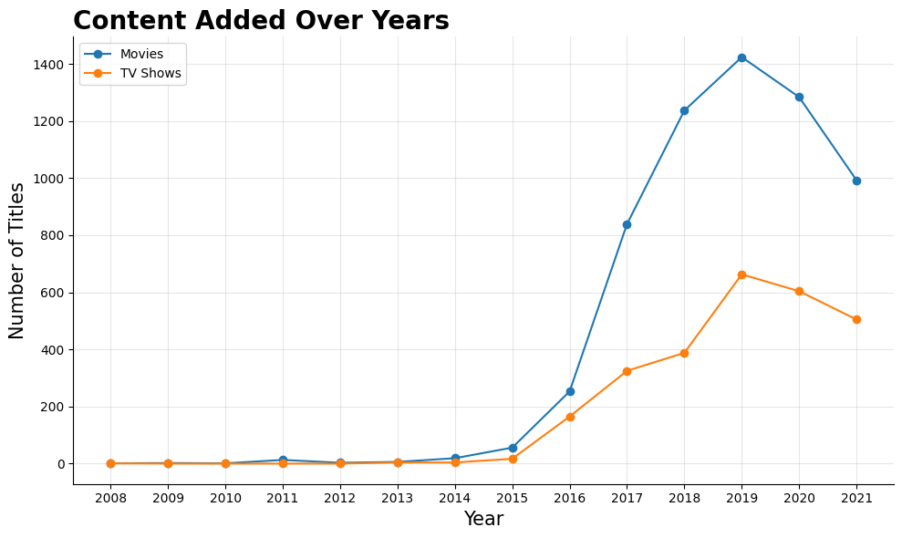

> **Key Takeaway:** Movies have consistently led TV Show additions year-over-year, but TV Shows have been growing at a faster rate since 2016. The gap narrowed significantly by 2020-2021, signalling Netflix's strategic shift toward serial content to drive subscriber retention and reduce churn.

---

## 🔑 Executive Summary — 5 Things Netflix Should Know

| # | Insight | Business Implication |
|---|---|---|
| 1 | 70% of content is Movies | TV Show pipeline needs expansion for retention |
| 2 | India has only 81 TV Shows | Major gap vs local OTT competitors |
| 3 | 60%+ content is TV-MA/TV-14 | Family content is underserved |
| 4 | Content peaked in 2019 | Post-COVID strategy shifted to quality over volume |
| 5 | International Movies is #1 genre | Global-first content strategy is working |

---

## 🛠️ Skills Demonstrated

- **Data Cleaning** — null handling, type conversion, regex-based fixes, mode imputation
- **Feature Engineering** — exploding multi-value columns, extracting year from datetime
- **Exploratory Data Analysis** — groupby, pivot tables, value counts, filtering
- **Data Visualization** — consistent dark Netflix theme, bar charts, pie charts, line charts, reference lines, value labels
- **Business Thinking** — every chart tied to a real content strategy decision
- **Documentation** — structured, GitHub-ready project reporting

---

## 👤 Author

**Abhay Panchal**
BBA (IGNOU) · BMS (DU SOL)
Aspiring Data Analyst · Python · SQL · Power BI · Excel

📍 Ghaziabad, Delhi NCR

---

*Dataset sourced from Kaggle. This is a portfolio project for learning and demonstration purposes.*
