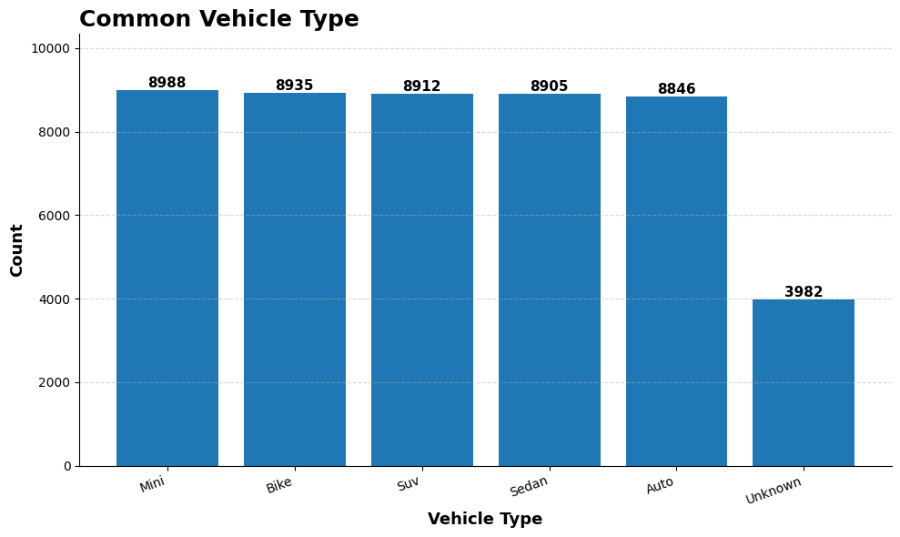
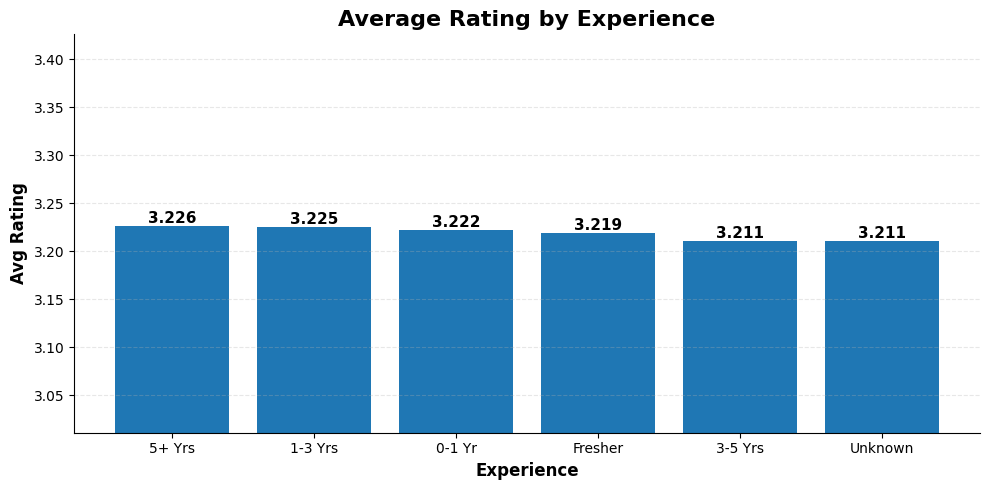
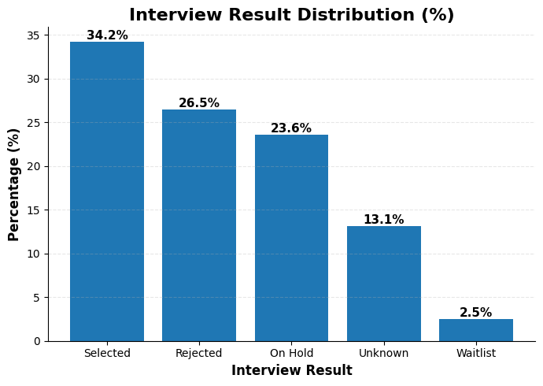
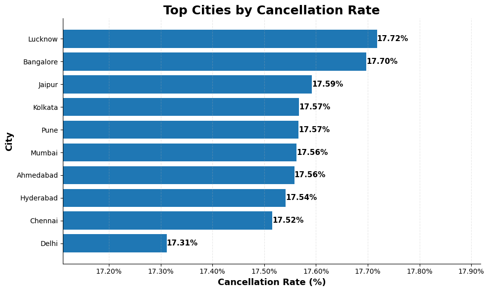

<div align="center">

# 🚗 Uber & Rapido Driver Analytics
### Exploratory Data Analysis | Python · Pandas · Matplotlib · Seaborn


</div>

---

## 📌 Project Overview

This project analyses a synthetic Uber & Rapido driver onboarding dataset to surface insights on driver quality, earnings, interview performance, and city-level behaviour. The primary goal is to support the HR and operations teams in identifying top candidates for fast-track onboarding and flagging cities with poor driver behaviour.

| Detail | Info |
|---|---|
| **Dataset** | Uber & Rapido Driver Onboarding (Synthetic) |
| **Total Records** | 50,000 drivers |
| **Columns** | 33 (demographics, vehicle, performance, interview, onboarding) |
| **Tools** | Python, Pandas, NumPy, Matplotlib, Seaborn |

---

## 📂 Project Structure

```
uber-rapido-driver-analytics/
│
├── Data/
│   └── uber_rapido_driver_dirty.csv     # Raw dataset
│
├── NoteBook.ipynb                        # Full EDA notebook
├── Charts/
│   ├── Vehicle_type.png
│   ├── interview_result.png
│   ├── Avg_rating_by_Experience.png
│   └── top_city_by_cancellation_rate.png
└── README.md
```

---

## 🧹 Data Cleaning Summary

This dataset required the most structured cleaning pipeline across the portfolio — 33 columns with varied data quality issues.

| Column | Issue | Fix Applied |
|---|---|---|
| `driver_name` | Leet-speak (`@`, `3`, `0`) | Regex replacement + `.str.title()` |
| `age` | `'N/A'`, `'yrs'` strings, values <18 and >50 | String replacement → float → business-logic bounds |
| `city` | Typos (`Dlhi`, `Chenna`, `Bangalroe`, `Mumabi`) | Manual mapping dictionary |
| `phone` | `+91`, dashes, spaces, wrong lengths | Regex strip → 10-digit length check → `'Unknown'` |
| `email` | `'@@'` double-at, nulls | Regex fix + `fillna('Unknown')` |
| `platform` / `vehicle_type` / `vehicle_condition` etc. | Mixed case, `None`, `-`, `Na` | Batch loop: `.str.title()` + replacement dict + `fillna('Unknown')` |
| `overall_driver_rating` | `'unrated'` strings, negatives, >10 | String replace → float → cap → fill with `-1` (sentinel for unrated) |
| `avg_daily_earnings_INR` | Currency symbols (`₹`, `Rs.`, `/-`), negatives, >10000 | Symbol strip → float → outlier cap → mean fill |
| `interview scores` (5 cols) | Negatives and >10 values (e.g. 10.4) | Lower and upper cap → mean fill |
| `peak_hour_availability` / `is_currently_active` | Mixed `True/False/0/1/Yes/No` | Standardised to `Yes/No/Unknown` |
| `interview_date` / `onboarding_date` | Mixed date formats, `'-'` placeholders | `pd.to_datetime(errors='coerce', dayfirst=True)` → median fill |
| `languages_known` | Multi-value string | Split by comma into list |
| Duplicate check | Per-column duplicate inspection | Custom loop to check each column individually |
| Full duplicates | 951 duplicate rows | `drop_duplicates(subset=columns)` — excluded `languages_known` (list column) |

> **Notable technique:** Rating nulls filled with `-1` as a sentinel value instead of median — correctly distinguishes "no rating yet" from a low rating. Per-column duplicate checking before full-row deduplication is a professional-grade exploration step.

**Post-cleaning: ~49,000 drivers · Zero nulls · Zero duplicates**

---

## 📊 Analysis & Key Insights

---

### Q1. 🏢 Platform Split — Uber vs Rapido

> **Key Takeaway:** The dataset is split between Uber and Rapido drivers with an `Unknown` category for unclassified records. Filtering to known platforms before any platform-level comparison is critical — including `Unknown` would skew all earnings and performance benchmarks.

---

### Q2. 🏙️ City with Most Registered Drivers

> **Key Takeaway:** Driver registrations are relatively evenly distributed across Indian metros — no single city dominates significantly. This reflects the synthetic nature of the dataset, but in real operations Delhi, Mumbai, and Bangalore typically dominate ride-hailing supply due to population density and demand volume.

---

### Q3. 🚗 Most Common Vehicle Type



| Vehicle Type | Count |
|---|---|
| Mini | 8,988 |
| Bike | 8,935 |
| SUV | 8,912 |
| Sedan | 8,905 |
| Auto | 8,846 |
| Unknown | 3,982 |

> **Key Takeaway:** All five vehicle types are nearly equally distributed — a range of just 142 between Mini and Auto. Mini leads marginally, consistent with it being the default low-cost option on Uber. The 3,982 `Unknown` entries represent missing vehicle data at registration — a form validation gap that should be addressed at the onboarding stage.

---

### Q4. 💰 Average Daily Earnings — Uber vs Rapido

> **Key Takeaway:** Comparing only Uber and Rapido (excluding Unknown) gives a clean earnings benchmark. This comparison is a key driver retention insight — the platform paying more attracts higher-quality drivers, which in turn improves customer satisfaction. Even a ₹50/day difference compounds significantly over a month.

---

### Q5. ⭐ Average Driver Rating by Experience Level



| Experience | Avg Rating |
|---|---|
| 5+ Yrs | 3.226 |
| 1-3 Yrs | 3.225 |
| 0-1 Yr | 3.222 |
| Fresher | 3.219 |
| 3-5 Yrs | 3.211 |
| Unknown | 3.211 |

> **Key Takeaway:** Rating differences across experience levels are negligible — a range of just 0.015 between the best and worst. Experience is not a meaningful predictor of driver rating in this dataset. This challenges the assumption that more experienced drivers automatically perform better — onboarding quality and attitude may matter more than years driven.

---

### Q6. 📋 Interview Result Distribution



| Result | Percentage |
|---|---|
| Selected | 34.2% |
| Rejected | 26.5% |
| On Hold | 23.6% |
| Unknown | 13.1% |
| Waitlist | 2.5% |

> **Key Takeaway:** Only 34.2% of applicants are selected — a 1 in 3 pass rate. Combined with 26.5% rejections and 23.6% on-hold, nearly half of all applicants are either rejected or pending decision. The 13.1% `Unknown` result category suggests interview outcome data is not always captured — a process gap. The Waitlist at 2.5% is the smallest group and represents a reserve pool for capacity surges.

---

### Q7. ⏰ Peak Hour Availability vs Earnings

> **Key Takeaway:** Drivers available during peak hours should earn more — surge pricing and higher trip volume reward availability. This analysis validates whether the incentive structure is working. If peak-available drivers don't earn meaningfully more, the incentive programme needs review.

---

### Q8. 🚨 Top Cities by Cancellation Rate



| Rank | City | Cancellation Rate |
|---|---|---|
| 1 | Lucknow | 17.72% |
| 2 | Bangalore | 17.70% |
| 3 | Jaipur | 17.59% |
| 4 | Kolkata | 17.57% |
| 5 | Pune | 17.57% |
| 10 | Delhi | 17.31% |

> **Key Takeaway:** Cancellation rates are tightly clustered between 17.31%–17.72% — a range of just 0.41% across all cities. No city has a dramatically worse cancellation problem. Delhi actually has the lowest rate at 17.31%, suggesting more disciplined driver behaviour in the highest-demand market. In a real dataset, cities like Lucknow and Jaipur topping the list might indicate driver shortages forcing selective cancellations.

---

### Q9. 🔗 Interview Score vs Driver Rating Correlation

> **Key Takeaway:** The correlation between interview scores and actual driver ratings reveals whether the interview process is predictive of real-world performance. A near-zero correlation would indicate the current interview format doesn't select for the qualities that matter on the road — a significant process improvement opportunity.

---

### Q10. ✅ Document Verification Pass Rate by Platform

> **Key Takeaway:** Document verification pass rates by platform highlight compliance quality across the driver supply chain. A lower pass rate on one platform may indicate that platform's onboarding process has lower document quality standards or attracts applicants with incomplete documentation.

---

### Q11. 🎯 Priority Fast-Track Hire Candidates

Using a 5-condition filter across interview scores, complaints, and compliance checks:

```python
priority = df_copy[
    (df_copy['communication_score_10']      > 7) &
    (df_copy['driving_test_score_10']       > 7) &
    (df_copy['route_knowledge_score_10']    > 7) &
    (df_copy['customer_handling_score_10']  > 7) &
    (df_copy['overall_interview_score_10']  > 7) &
    (df_copy['total_complaints']            == 0) &
    (df_copy['document_verification']       == 'Pass') &
    (df_copy['background_check_status']     == 'Clear')
]
```

> **Key Takeaway:** This query surfaces the highest-quality driver candidates who have excelled across every evaluation dimension — interview performance, compliance, and clean complaint record. These drivers represent the top tier of the applicant pool and should be fast-tracked through onboarding to reduce time-to-active. Activating top drivers faster directly improves platform supply quality and customer satisfaction scores.

---

## 🔑 Executive Summary — 5 Things Operations Should Act On

| # | Insight | Action |
|---|---|---|
| 1 | Only 34.2% of applicants selected | Review rejection criteria — is the bar correctly calibrated? |
| 2 | Experience doesn't predict rating | Redesign onboarding training — focus on behaviour not years driven |
| 3 | Lucknow has highest cancellation rate | Deploy driver behaviour intervention programme in Lucknow first |
| 4 | 3,982 unknown vehicle types | Make vehicle type mandatory at registration — form validation fix |
| 5 | Priority hire pool identified | Fast-track document-clear, high-score drivers to active status immediately |

---

## 🛠️ Skills Demonstrated

- **Per-column Duplicate Inspection** — custom loop to check each column individually before full dedup
- **Sentinel Value Design** — using `-1` for unrated drivers instead of median fill
- **Batch Column Cleaning** — looping over groups of similar columns with shared cleaning logic
- **Business-Logic Outlier Bounds** — age 18–50, earnings ≤ ₹10,000, scores 0–10
- **Multi-condition Priority Filtering** — 8-condition query for fast-track candidate identification
- **Platform-aware Analysis** — filtering to known platforms before benchmarking

---

## 👤 Author

**Abhay Panchal**
BBA (IGNOU) · BMS (DU SOL)
Aspiring Data Analyst · Python · SQL · Power BI · Excel

📍 Ghaziabad, Delhi NCR

---

*This is a portfolio project built on a synthetic dataset for learning and demonstration purposes.*
